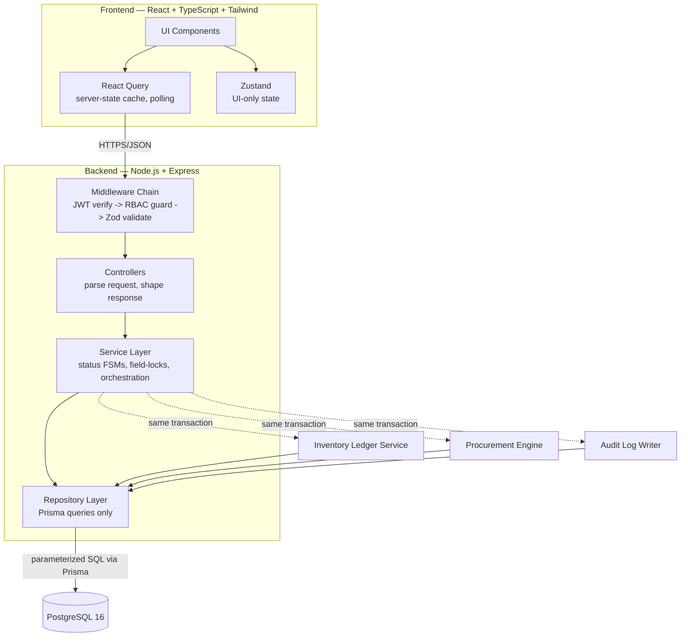
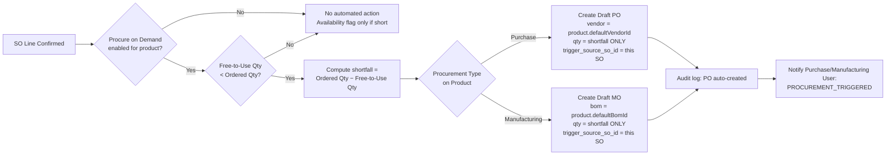
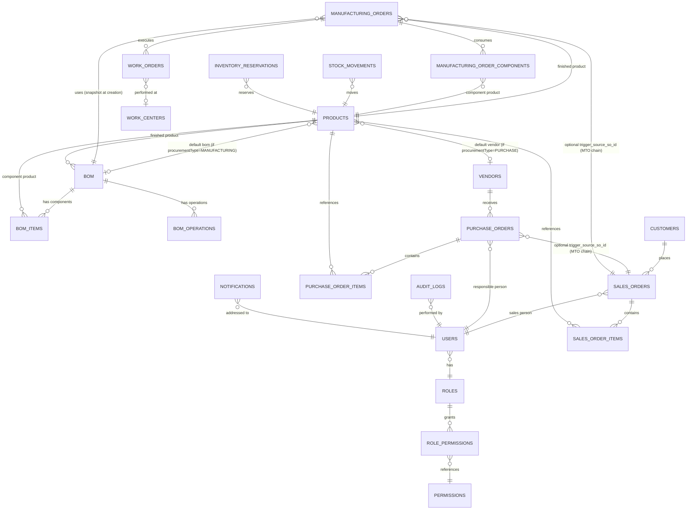
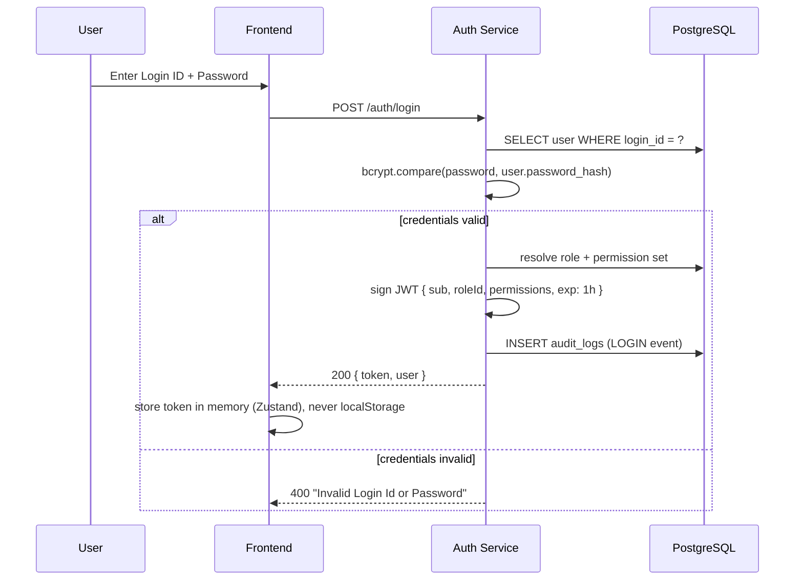

# FINAL TECHNICAL REQUIREMENTS DOCUMENT (TRD)

## Mini ERP: From Demand to Delivery — "Shiv Furniture Works"

**Version:** Final (Architecture Review Consolidation) · **Companion document:** `FINAL_PRD.md` (binding source of all functional requirements, business rules, and acceptance criteria referenced throughout this document)

> Every section below implements a specific FR/NFR/business rule from `FINAL_PRD.md`. Where this document makes a technical choice, it cites the PRD clause it satisfies (e.g. "PRD FR-3.4") so the two documents never drift apart.

---

## 1. Tech Stack (Fixed, Non-Negotiable)

| Layer         | Choice                                                  | Why                                                                                                                                                                                                                                       |
| ------------- | ------------------------------------------------------- | ----------------------------------------------------------------------------------------------------------------------------------------------------------------------------------------------------------------------------------------- |
| Frontend      | React 18, TypeScript, TailwindCSS, React Query, Zustand | React Query owns server-state caching/invalidation; Zustand owns pure UI state (active filters, modal open/closed, Kanban view toggle) — splitting these prevents the classic mistake of re-fetching business data through a global store |
| Backend       | Node.js 20, Express 4                                   | Mandated stack; Express's middleware chain maps directly onto Auth → RBAC → Validation → Controller, which this design leans on heavily                                                                                                   |
| Database      | PostgreSQL 16                                           | Mandated; native `ENUM` types, `NUMERIC` precision, and `SELECT ... FOR UPDATE` row locking are used as first-class features, not worked around                                                                                           |
| ORM           | Prisma                                                  | Mandated; `$transaction` is the backbone of every multi-table mutation in this system (PRD NFR "Consistency")                                                                                                                             |
| Auth          | JWT (access token, short-lived)                         | Mandated; PRD FR-1.2, NFR "Security"                                                                                                                                                                                                      |
| Authorization | RBAC, server-enforced                                   | Mandated; PRD NFR "Security" — "RBAC enforced server-side on every endpoint, independent of what the UI hides"                                                                                                                            |
| Deployment    | Docker Compose, single command                          | PRD NFR "Portability" — `docker-compose up`, one migration + seed script, no manual steps                                                                                                                                                 |

**Explicitly rejected (and why):** a FastAPI/Python backend and a Redis/WebSocket real-time layer were both considered (they appear in earlier drafts of this project) and rejected. FastAPI is excluded because the PRD's fixed stack is Node/Express — not a judgment on FastAPI's merits, simply scope discipline. Redis and WebSockets are excluded because PRD §15 (Constraints) explicitly states "no mandatory Redis or WebSockets (notification polling is sufficient)" — introducing infrastructure the constraints explicitly waive only adds failure surface in a 12-hour window for a capability (sub-second push) the demo does not need.

---

## 2. System Architecture



**Why this shape, and what it directly satisfies:**

- **The Service Layer is the only place business rules live** — status transitions, reservation math, field-lock enforcement, procurement triggers. Controllers stay thin (parse → call service → shape response). This directly implements PRD NFR "Usability": _"Status-driven field locking is enforced server-side ... not merely hidden in the UI"_ — that sentence is not achievable if validation logic leaks into controllers or the frontend.
- **Inventory, Procurement, and Audit are modeled as in-process service calls inside the same Prisma transaction as the triggering business action** — not events on a queue, not a separate microservice. This directly implements PRD NFR "Consistency": _"the stock movement, the cached on-hand update, the reservation change, and the audit log write succeed or fail together in one DB transaction."_ A message broker or async worker would make that sentence false by construction (the write would be eventually, not atomically, consistent), so it is rejected outright for this scope, not merely "deferred for later" — it would silently violate a binding PRD guarantee.
- **Repositories are thin Prisma wrappers with intention-revealing methods** (`findForUpdate`, `incrementOnHand`), never a generic `update(data)` — this is what makes server-side field-lock enforcement actually enforceable: a generic update method lets a service accidentally write to a locked field, while a method named `updateDeliveredQty` simply has no parameter for `customerId`.

---

## 3. Frontend Architecture

### 3.1 Folder Structure

```
apps/web/
├── src/
│   ├── api/                      # one file per module, React Query hooks only
│   │   ├── auth.api.ts
│   │   ├── products.api.ts
│   │   ├── sales-orders.api.ts
│   │   ├── purchase-orders.api.ts
│   │   ├── manufacturing-orders.api.ts
│   │   ├── bom.api.ts
│   │   ├── inventory.api.ts
│   │   ├── audit-logs.api.ts
│   │   ├── dashboard.api.ts
│   │   └── notifications.api.ts
│   ├── components/
│   │   ├── ui/                   # shared primitives: Button, Badge, StatusChip, Table, Modal
│   │   └── shared/                # AppBar, Sidebar, AuditLogDrawer, KpiTile, FieldLockBanner
│   ├── features/                  # vertical slices, one per module — mirrors backend modules/ 1:1
│   │   ├── auth/
│   │   ├── products/
│   │   ├── sales-orders/
│   │   ├── purchase-orders/
│   │   ├── manufacturing-orders/
│   │   ├── bom/
│   │   ├── inventory/
│   │   ├── audit-logs/
│   │   ├── dashboard/
│   │   └── procurement/           # recommendation engine view, traceability stepper
│   ├── store/                      # Zustand: activeFilters, modalState, kanbanViewToggle — UI state ONLY
│   ├── routes/                     # route definitions + route guards
│   ├── types/                      # status enums, permission enums — hand-synced with backend (Section 3.4)
│   └── main.tsx
```

**Why vertical slices (`features/`), not horizontal layers (`pages/`, `components/`, `hooks/` at the top level):** with a small team building in parallel under a 12-hour clock, two people can own Sales and Manufacturing simultaneously without their changes touching the same files. This is a hackathon-velocity decision as much as a code-organization one, and it is intentionally mirrored 1:1 against the backend's `modules/` layout (Section 4.1) so the same person can reason about a feature's frontend and backend in one mental model.

### 3.2 State Management Strategy

| State category                                             | Owner                                                             | Examples                                                                       |
| ---------------------------------------------------------- | ----------------------------------------------------------------- | ------------------------------------------------------------------------------ |
| Server data (anything that lives in Postgres)              | React Query                                                       | product list, SO detail, dashboard counters, audit logs                        |
| Pure UI state (never persisted, never shared across users) | Zustand                                                           | which status-chip filter is active, Kanban-vs-list toggle, which modal is open |
| Auth session                                               | Zustand (persisted to memory only, not localStorage — Section 11) | current JWT, decoded permission claims                                         |

**Rule:** if a value is ever fetched from or written to the API, it lives in React Query, never duplicated into Zustand. This single rule eliminates an entire class of "stale cache vs stale store" bugs that would otherwise burn hours of hackathon debugging time.

**Polling, not WebSockets, for near-real-time updates** (PRD §11.5, Constraints): the Notification Center and dashboard KPI tiles poll via React Query's `refetchInterval` (every 5–10s). This directly satisfies the PRD's explicit, judge-facing tradeoff: _"correctness and demoability beat infrastructure risk in a 12-hour window."_

### 3.3 Route Guard (RBAC on Frontend)

The frontend route guard is a **UX convenience only** — it hides navigation items and redirects unauthorized users to avoid a confusing blank page. It is never the actual security boundary; every PRD acceptance criterion about RBAC ("a Sales User's API call to a Purchase-only endpoint returns `403 Forbidden`, independent of any UI state") is enforced server-side (Section 5). The frontend guard reads the same `(module, action)` permission claims embedded in the JWT at login and short-circuits rendering — nothing more.

### 3.4 Type Sharing Strategy

Status enums (`SO_STATUS`, `PO_STATUS`, `MO_STATUS`), permission enums (`module_name`, `permission_action`), and request/response shapes for every endpoint in Section 8 are hand-synced between `apps/api/src/common/constants` and `apps/web/src/types` for this build. A shared `packages/shared-types` workspace package (generated from the Prisma schema's enums, plus hand-written DTOs for request/response bodies) is the immediate next step post-hackathon — deferred here only because setting up a monorepo type-sharing pipeline costs setup time disproportionate to its hackathon-window payoff versus simply keeping two small enum files in sync by hand.

---

## 4. Backend Architecture

### 4.1 Folder Structure

```
apps/api/
├── prisma/
│   ├── schema.prisma
│   ├── migrations/
│   └── seed.ts                    # roles, permissions, demo users, demo products/vendors/customers
├── src/
│   ├── config/                    # env loader, Prisma client singleton
│   ├── middleware/
│   │   ├── auth.middleware.ts         # JWT verify -> req.user
│   │   ├── rbac.middleware.ts         # requirePermission(module, action)
│   │   ├── error.middleware.ts        # central error handler -> error envelope
│   │   └── validate.middleware.ts     # Zod request-shape validation
│   ├── modules/                   # vertical slice per business module
│   │   ├── auth/
│   │   ├── users/
│   │   ├── products/
│   │   │   ├── products.controller.ts
│   │   │   ├── products.service.ts
│   │   │   ├── products.repository.ts
│   │   │   ├── products.routes.ts
│   │   │   └── products.schema.ts     # Zod request schemas
│   │   ├── customers/
│   │   ├── vendors/
│   │   ├── sales-orders/
│   │   ├── purchase-orders/
│   │   ├── manufacturing-orders/
│   │   ├── bom/
│   │   ├── inventory/                 # stock ledger + reservation engine — Section 9
│   │   │   ├── inventory.service.ts
│   │   │   ├── stock-movement.repository.ts
│   │   │   └── reservation.engine.ts
│   │   ├── procurement/                # auto PO/MO trigger + recommendation engine — Section 10
│   │   │   ├── procurement.engine.ts
│   │   │   └── recommendation.engine.ts
│   │   ├── audit-logs/
│   │   ├── dashboard/
│   │   └── notifications/
│   ├── common/
│   │   ├── errors/                    # ValidationError, ForbiddenError, ConflictError, NotFoundError
│   │   ├── utils/                      # sequence/reference-code generator, money/qty rounding helpers
│   │   └── constants/                  # status enums, permission enums
│   ├── app.ts
│   └── server.ts
├── Dockerfile
└── package.json
```

**Why `modules/` (vertical slice), not top-level `controllers/`, `services/`, `repositories/`:** identical reasoning to Section 3.1 — parallel team velocity under a hard deadline. A second, equally real reason: every module here (Sales, Purchase, Manufacturing) is a near-identical Draft → Confirm → Fulfill → Lock pattern (PRD Business Rule 3). Co-locating each module's controller/service/repository/routes/schema makes that repetition visible and copy-paste-adaptable, which is exactly the kind of structural pattern recognition that saves hours when three people are each implementing "their" Draft/Confirm/Fulfill module in parallel.

### 4.2 Standard API Response Envelope

```json
// Success
{
  "data": { },
  "meta": { "page": 1, "pageSize": 20, "total": 134 },
  "error": null
}

// Error
{
  "data": null,
  "meta": null,
  "error": { "code": "VALIDATION_ERROR", "message": "Delivered quantity exceeds ordered quantity", "fields": { "deliveredQty": "..." } }
}
```

One envelope shape, always. This removes an entire category of frontend `if (response.data) ... else if (response.items) ...` defensive code that costs more hours than it saves under time pressure.

### 4.3 Middleware Chain (applied in this exact order, per route)

```
1. error.middleware.ts        (wraps everything; catches whatever falls through)
2. auth.middleware.ts          (JWT verify -> req.user = { id, roleId, permissions })
3. rbac.middleware.ts           (requirePermission(module, action) -> 403 if absent)
4. validate.middleware.ts        (Zod schema on req.body/req.query -> 422 if shape-invalid)
5. controller                    (parse -> call service -> shape response)
```

A route with no explicit `requirePermission()` call is treated as a **configuration bug, not an open endpoint** — this is a fail-closed posture (PRD NFR "Security"), not fail-open. Every route file is reviewed against this rule before merge.

---

## 5. RBAC Design

### 5.1 Data Model

RBAC is modeled as **data, not code** — directly per PRD §5 (Target Users) and the role-to-module mapping implied across every FR section:

- `roles` — the six PRD roles: Admin, Business Owner, Sales User, Purchase User, Manufacturing User, Inventory Manager.
- `permissions` — catalog of `(module, action)` pairs the system understands. Decoupling this from `role_permissions` means adding a new module/action is a data change, never a code change.
- `role_permissions` — one row per `(role, permission)` with a tri-state `access_level`: `ADMIN` (full), `USER` (scoped/own-records-only where relevant), `NONE`.

### 5.2 Permission Matrix (derived from PRD §5 and FR sections)

| Module                      | Admin       | Business Owner    | Sales User            | Purchase User         | Manufacturing User    | Inventory Manager |
| --------------------------- | ----------- | ----------------- | --------------------- | --------------------- | --------------------- | ----------------- |
| Products                    | ADMIN       | ADMIN             | VIEW                  | VIEW                  | VIEW                  | VIEW              |
| Sales Orders                | ADMIN       | VIEW              | ADMIN                 | NONE                  | NONE                  | VIEW              |
| Purchase Orders             | ADMIN       | VIEW              | NONE                  | ADMIN                 | VIEW                  | VIEW              |
| Manufacturing Orders        | ADMIN       | VIEW              | NONE                  | VIEW                  | ADMIN                 | VIEW              |
| Bill of Materials           | ADMIN       | VIEW              | NONE                  | NONE                  | ADMIN (edit)          | VIEW              |
| Vendors                     | ADMIN       | VIEW              | NONE                  | ADMIN                 | VIEW                  | VIEW              |
| Customers                   | ADMIN       | VIEW              | ADMIN                 | NONE                  | NONE                  | NONE              |
| Inventory / Stock Movements | ADMIN       | VIEW              | VIEW (own SO context) | VIEW (own PO context) | VIEW (own MO context) | ADMIN             |
| Audit Logs                  | ADMIN       | NONE              | NONE                  | NONE                  | NONE                  | NONE              |
| User Management             | ADMIN       | NONE              | NONE                  | NONE                  | NONE                  | NONE              |
| Dashboards                  | ADMIN (all) | ADMIN (all, read) | own scope             | own scope             | own scope             | own scope         |

This directly implements PRD §13 Acceptance Criteria: _"A Sales User's API call to a Purchase-only endpoint returns `403 Forbidden`, independent of any UI state."_ Audit Logs are Admin-only per PRD FR-8 and the briefing's explicit statement that Admin alone "monitors system activities and audit trails."

### 5.3 Enforcement

```ts
router.patch(
  '/sales-orders/:id/confirm',
  requireAuth,
  requirePermission('SALES', 'APPROVE'),
  salesOrderController.confirm,
);
```

- Permission claims are embedded in the JWT at login (avoids a DB round-trip per request).
- **A server-side permission re-check happens on every mutating request regardless of claims** — claims can be stale if an Admin changes a user's role mid-session; re-checking against the live `role_permissions` table on mutating actions closes that window. Read-only `VIEW` checks may trust the JWT claim, since a stale "can view" claim is a far lower-severity risk than a stale "can approve/delete" claim.
- Field-level exceptions that don't fit the module/action matrix — e.g. PRD FR-1.4's _"Position is read-only to the user and editable only by an Admin"_ — are explicit checks inside the relevant service method, not generic matrix entries. Modeling one field's special rule generically would over-engineer the schema for a rule that applies to exactly one field on one entity.

---

## 6. Inventory Ledger Design — The Core of This Architecture

> PRD §3 states the binding premise: _"On Hand Quantity = Σ all stock movements ever recorded for a product."_ This section is the technical contract that makes that sentence literally, provably true — not aspirational copy in a requirements document.

### 6.1 The Three Numbers

```
On Hand Qty       = physical stock actually in the warehouse right now
Reserved Qty      = stock already promised to open Sales Orders or open Manufacturing Orders
Free To Use Qty   = On Hand Qty − Reserved Qty
```

**On Hand Quantity**

- Stored as a cached column `products.on_hand_qty` for read performance (PRD NFR "Performance": dashboard/list queries under 500ms — recomputing a SUM over the entire ledger on every product-list render would not meet that bar at scale).
- The **only legal way to change it** is inserting a row into `stock_movements` and, in the same database transaction, applying its signed delta to the cached column. There is no code path — no migration script, no admin tool, no "quick fix" endpoint — that runs `UPDATE products SET on_hand_qty = X` without a corresponding ledger row. This is PRD Design Consequence #1 (§3), enforced structurally: the only repository method that touches `on_hand_qty` is `StockMovementRepository.recordMovement()`, and it always writes both rows in one call.
- **Reconciliation invariant**, must hold at all times — this is PRD §13's literal acceptance criterion, expressed as a runnable query:
  ```sql
  SELECT p.id, p.on_hand_qty,
         COALESCE(SUM(CASE WHEN sm.direction = 'IN' THEN sm.quantity ELSE -sm.quantity END), 0) AS ledger_total
  FROM products p
  LEFT JOIN stock_movements sm ON sm.product_id = p.id
  GROUP BY p.id, p.on_hand_qty
  HAVING p.on_hand_qty <> COALESCE(SUM(CASE WHEN sm.direction = 'IN' THEN sm.quantity ELSE -sm.quantity END), 0);
  ```
  This query must always return zero rows. It is run as a pre-demo sanity check (and exposed as an Admin-only endpoint, Section 8.9) — literal, runnable proof for a judge who asks "how do I know your stock numbers are real."

**Reserved Quantity**

- **Never cached.** Computed live from exactly two sources, per PRD §3 Design Consequence #2 — reservation exists _because_ an order is in a reserving status, and disappears the instant it leaves that status:
  ```
  Reserved Qty (product P) =
        SUM(sales_order_items.ordered_qty − sales_order_items.delivered_qty)
            WHERE product_id = P AND sales_order.status IN ('CONFIRMED', 'PARTIALLY_DELIVERED')
      + SUM(manufacturing_order_components.consumed_qty)
            WHERE component_id = P AND manufacturing_order.status IN ('CONFIRMED', 'IN_PROGRESS')
  ```
- Backed by an explicit `inventory_reservations` table (Section 9) rather than re-deriving this query inline everywhere it's needed. The table holds one **active** row per (SO line | MO component) while that line is in a reserving state; `SUM(reserved_qty WHERE is_active)` per product gives the same number as the formula above. The table exists so release-on-cancel/release-on-fulfillment is a single `UPDATE is_active = false`, not a re-implementation of order-status logic in five different places in the codebase.

**Free To Use Quantity**

```
Free To Use Qty = On Hand Qty − Reserved Qty
```

Never stored as a column anywhere. Always read from the `product_inventory_summary` view (Section 9.5). This is the single biggest correctness guarantee in the system: there is no column to accidentally update incorrectly, because there is no column at all — the formula and the queryable value are the same expression.

### 6.2 Stock Movement Ledger — Write Rules

| Event                                             | Direction | Quantity Written                                                         | `source_type`       | PRD Clause |
| ------------------------------------------------- | --------- | ------------------------------------------------------------------------ | ------------------- | ---------- |
| Purchase Order line received                      | IN        | **delta** (new received − previous received), never the cumulative total | `PURCHASE_RECEIPT`  | FR-4.4     |
| Sales Order line delivered                        | OUT       | **delta** (new delivered − previous delivered)                           | `SALES_DELIVERY`    | FR-3.5     |
| MO component consumed, written at MO Done         | OUT       | final `consumed_qty` per component                                       | `MO_CONSUMPTION`    | FR-5.6     |
| MO finished good produced, written at MO Done     | IN        | `mo.quantity`                                                            | `MO_PRODUCTION`     | FR-5.6     |
| Manual stock correction (Admin/Inventory Manager) | IN or OUT | entered value                                                            | `MANUAL_ADJUSTMENT` | FR-2.4     |

**The single most important rule in this entire ledger design:** every partial-fulfillment movement is the **delta between this update and the last**, never the cumulative value. PRD FR-3.5 states this explicitly: _"Each delivery call emits a stock movement for the delta between the new and previous delivered quantity — never the cumulative total — so repeated partial calls never double-count."_ Concretely: a PO line goes from `received_qty = 0` to `received_qty = 6` (a partial receipt) → the movement written is `+6`. It later goes to `received_qty = 10` (completing it) → the movement written is `+4`, not `+10`. Getting this wrong (writing the cumulative value both times) would double-count stock on every partial-then-full sequence — this is the single highest-value correctness test to write and run before the demo.

### 6.3 Inventory Reservation Engine

**Reserve** (called on SO Confirm, per line; and on MO Confirm, per component — but see the manufacturing-specific nuance in Section 7.3):

```ts
async function reserve(
  tx,
  productId: string,
  qty: number,
  source: { type: 'SALES_ORDER' | 'MANUFACTURING_ORDER'; id: string },
) {
  await tx.product.lockForUpdate(productId); // SELECT ... FOR UPDATE — see Section 6.5 on concurrency
  await tx.inventoryReservation.create({
    productId,
    sourceType: source.type,
    sourceId: source.id,
    reservedQty: qty,
    isActive: true,
  });
}
```

**Release** (called on Cancel, or on reaching a terminal fulfilled state):

```ts
async function release(tx, sourceType: string, sourceId: string) {
  await tx.inventoryReservation.updateMany({
    where: { sourceType, sourceId, isActive: true },
    data: { isActive: false, releasedAt: new Date() },
  });
}
```

**Adjust** (called on partial delivery / partial consumption): a partial delivery does not fully release the reservation — it reduces it. Rather than mutating the existing reservation row's quantity in place (which would lose the history of what was reserved when), the engine closes the old reservation row and opens a new one for the remaining outstanding quantity:

```ts
async function adjustReservation(tx, sourceType, sourceId, newOutstandingQty) {
  await release(tx, sourceType, sourceId);
  if (newOutstandingQty > 0) {
    await tx.inventoryReservation.create({
      ...sameProductAndSource,
      reservedQty: newOutstandingQty,
      isActive: true,
    });
  }
}
```

### 6.4 Worked Examples (traceable directly to PRD §13 Acceptance Criteria and the Hackathon Briefing's OM formulas)

**Example A — sufficient stock, no procurement triggered:**

- Wooden Chair: On Hand = 100, Reserved = 0, Free-to-Use = 100.
- Customer orders 10. Confirm → reserve 10 → Free-to-Use = 90.
- Deliver 10 → `stock_movements` OUT 10 → On Hand = 90; reservation released → Reserved = 0 → Free-to-Use = 90. Consistent.

**Example B — shortage triggering Manufacturing (matches PRD §13's literal MO-completion acceptance criterion):**

- Dining Table: On Hand = 5, Reserved = 0, Free-to-Use = 5.
- Customer orders 20. Confirm → full 20 reserved against the SO line (PRD FR-3.4: _"reservation represents commitment, not capped availability"_ — it does not cap at available stock). Free-to-Use check: 20 > 5 → Availability flag = false.
- Procurement Engine (Section 7) evaluates: required 20, free-to-use 5 → shortfall = **15**.
- `Procurement Type = Manufacturing` → auto-create Draft MO for exactly **15** units, `trigger_source_so_id` = this SO.
- MO Confirm begins component reservation tracking (Section 7.3). MO Done → consumes components (OUT movements at final consumed qty) → produces 15 Dining Tables (IN movement) → On Hand becomes 20.
- SO Deliver 20 → OUT movement 20 → On Hand = 0; SO reservation released → Free-to-Use = 0. Consistent.

**Example C — Manufacturing 10 Tables (PRD's literal MO Completion acceptance criterion, BoM: 4 Legs / 1 Top / 12 Screws):**

- `required_qty` on components computed at MO Confirm: `bom_items.quantity × (mo.quantity / bom.reference_quantity)` → Legs 40, Tops 10, Screws 120.
- MO Done → movements: Legs OUT 40, Tops OUT 10, Screws OUT 120, Tables IN 10 — in one transaction, exactly satisfying PRD §13: _"Completing an MO for 10 Tables ... writes OUT 40 Legs / 10 Tops / 120 Screws and IN 10 Tables, in one transaction."_

### 6.5 Transaction-Safety & Concurrency Strategy

This section is the technical answer to PRD §13's concurrency acceptance criterion and NFR "Concurrency Safety": _"Two simultaneous SO confirmations against a product with only enough stock for one succeed sequentially, never both fully."_

1. **Every multi-step inventory operation runs inside exactly one Prisma `$transaction`.** No exceptions. A stock movement insert, the cached on-hand update, the reservation change, and the audit log write are atomic as a single unit — this is PRD NFR "Consistency" implemented literally, not approximated.
2. **Row-level locking on the product row** during reservation and stock-movement writes: `SELECT * FROM products WHERE id = $1 FOR UPDATE` is issued before reading current On Hand/Free-to-Use inside any transaction that will write to that product's stock. This is what prevents two concurrent Sales Order confirmations from both succeeding against the same limited stock — the second transaction blocks on the lock until the first commits, then re-reads Free-to-Use with the first transaction's effect already visible. This directly satisfies PRD §9 Edge Cases: _"Row-level lock (`SELECT ... FOR UPDATE`) on the product during reservation; the second transaction re-reads Free-to-Use after the first commits."_
3. **Isolation level: `READ COMMITTED`** (Postgres's default) is sufficient given the explicit row-lock strategy above. `SERIALIZABLE` was considered and rejected — it would add application-level retry-handling complexity for a guarantee that explicit locking already provides at the one contention point that matters (the product row during stock-affecting writes). Adding it would be defensive engineering against a class of bug that the locking strategy has already structurally eliminated.
4. **Idempotency on partial-update endpoints:** the client always sends the _new cumulative value_ ("received_qty is now 10"), and the server computes the delta itself inside the lock, from the database's current state at that instant — never from a value the client computed client-side and might be sending against stale data. This closes the race window between two people submitting receipts for the same PO concurrently.
5. **Manufacturing's specific lock-ordering rule** (PRD FR-5.6, "lock all component products, deterministic order"): on MO Done, every component product row plus the finished product row are locked `FOR UPDATE` in a deterministic order (sorted by product UUID) before any writes happen. This prevents a deadlock scenario where two concurrent MOs touching an overlapping component set lock rows in opposite orders.
6. **Failure behavior:** any exception inside a transaction — a constraint violation, a thrown business-rule error — rolls back the entire operation. A failed component consumption can never leave a half-produced finished good or a partially-decremented stock movement visible to any concurrent reader (PRD NFR "Reliability").

### 6.6 Computed Views — The Inventory Truth Layer

```sql
-- product_inventory_summary
-- THE single canonical place "Free To Use = On Hand - Reserved" lives.
-- Every dashboard, every product list, every SO-line availability check
-- reads from here — never re-implements the subtraction inline.
CREATE VIEW product_inventory_summary AS
SELECT
    p.id                AS product_id,
    p.reference,
    p.name,
    p.on_hand_qty,
    COALESCE(r.reserved_qty, 0)                        AS reserved_qty,
    p.on_hand_qty - COALESCE(r.reserved_qty, 0)         AS free_to_use_qty,
    p.reorder_point,
    (p.on_hand_qty - COALESCE(r.reserved_qty, 0)) < p.reorder_point AS is_low_stock
FROM products p
LEFT JOIN (
    SELECT product_id, SUM(reserved_qty) AS reserved_qty
    FROM inventory_reservations
    WHERE is_active = true
    GROUP BY product_id
) r ON r.product_id = p.id
WHERE p.deleted_at IS NULL;
```

This view is also where the Hackathon Briefing's Operations-Management formulas attach (PRD §11.2):

```
Reorder Point  = (Average Daily Usage × Vendor Lead Time) + Safety Stock
Safety Stock   = Maximum Daily Usage × Maximum Historical Delivery Delay
```

Both are pure read-models computed from existing `stock_movements` (for usage rate) and `purchase_orders`/`vendors` (for lead time and historical delay) — no new write path, no new table, no AI. This is what lets the system show a **formula-derived** reorder point rather than a hard-coded threshold, which the Briefing identifies as the single highest-impact-per-dev-hour feature (§7.1) and which materially differentiates this build from a CRUD app with a static "low stock" flag.

---

## 7. Procurement Engine Design

> PRD FR-7 and §11.1 define this engine's behavior precisely. This section is its implementation contract. **No AI, no heuristic estimation, no invented numbers anywhere in this engine** — every input is read from data that already exists in the system, and every output is a number a judge can re-derive by hand from that same data.

### 7.1 Trigger & Auto-Creation Flow



Implemented as a stateless function `evaluate(tx, productId, requiredQty, actor)`, called from inside the same transaction as SO confirmation (Section 8.5). It reads the product's procurement configuration, computes shortfall using the **exact same** Free-to-Use calculation defined in Section 6.1 — one formula, one function, called from every place that needs it, never duplicated — and creates the Draft PO/MO via the existing PO/MO repositories, so the auto-created record goes through identical validation as one a human created by hand. This satisfies PRD FR-7.2/7.3 ("quantity = shortfall only, never the full order quantity") and PRD FR-4.6/§8 Business Rule 3 (an auto-created PO/MO still requires a human Confirm — _"the engine never auto-confirms"_).

**MTS vs. MTO, made concrete:** the Briefing (§3.6) frames this as a strategic product-level choice. In this implementation it is not a separate flag — it falls directly out of the existing `procure_on_demand` + `procurement_type` configuration on the product (PRD FR-2.2): a product with `procure_on_demand = false` is implicitly Make-to-Stock-only (no automatic replenishment; Inventory Manager restocks manually), while `procure_on_demand = true` makes every shortage event into an automatic, shortfall-sized Make-to-Order-style replenishment regardless of whether the route is Purchase or Manufacture. This avoids introducing a redundant "MTS/MTO" enum that would just duplicate information `procure_on_demand` already encodes.

### 7.2 Strategic Procurement Recommendation Engine (PRD §11.1 — deterministic, explainable, no AI)

When a shortage is detected and the product's configuration makes both routes plausible (or as an advisory layer shown alongside the automatic single-route trigger), the engine scores both options using only data that already exists elsewhere in the system:

```
Score(Purchase)     = 0.5 × NormalizedCost + 0.3 × NormalizedLeadTime
Score(Manufacture)  = 0.5 × NormalizedCost + 0.3 × NormalizedLeadTime + 0.2 × MaterialShortagePenalty

MaterialShortagePenalty = (components currently short) / (total components) × 1.0

Lower score wins.
```

| Input                     | Source — never invented                                                                                             |
| ------------------------- | ------------------------------------------------------------------------------------------------------------------- |
| Purchase cost             | `shortfallQty × product.costPrice` (or vendor-specific price if modeled)                                            |
| Purchase lead time        | `vendor.leadTimeDays`                                                                                               |
| Manufacture cost          | `SUM(bom_items.quantity × component.costPrice)` scaled to shortfall qty                                             |
| Manufacture lead time     | `SUM(bom_operations.duration_minutes)` scaled, converted to days                                                    |
| Material shortage penalty | live check: for each BoM component, is `product_inventory_summary.free_to_use_qty` < the qty this MO would require? |

**Why this design and not a fancier one:** the PRD is explicit — _"Do NOT use AI for decision making. Use explainable business logic. The recommendation must be auditable and deterministic."_ A weighted linear score over fully-sourced inputs is the simplest design that satisfies "auditable and deterministic" literally: a judge can be shown the raw numbers (cost, lead time, shortage ratio), the weights (0.5/0.3/0.2), and the resulting score, and reproduce it by hand with a calculator. Any model-based or trained-heuristic approach would fail the PRD's "auditable" requirement by construction, regardless of accuracy — so it was never on the table.

**Output is shown to the user with both the raw numbers and the resulting score** (PRD §11.1) — this is the literal feature that survives a judge's "how did the system decide that" question, which is exactly the question an opaque recommendation cannot answer.

### 7.3 Why Reservation "Ramps Up" During Manufacturing Rather Than Spiking at Confirm

This is a deliberate, literal reading of PRD FR-5.4: _"Begins tracking component reservation, which ramps up with logged Consumed Qty rather than spiking fully at Confirm."_ On MO Confirm, `manufacturing_order_components.required_qty` is computed and locked in, but the **reservation contribution** placed against each component is its `consumed_qty` — which starts at 0. As the operator logs consumption during production, the reservation grows to match. On MO Done, the final `consumed_qty` (which may differ from the originally planned `required_qty` — operators sometimes use more or less material than planned) is what gets written as the OUT stock movement, and the reservation is released in full. This means reservation is conservative early in a production run and catches up to actual commitment as work proceeds, rather than locking up the full planned quantity of every component the instant an MO is confirmed — which would otherwise make Free-to-Use look artificially scarcer than the real, current commitment for the entire duration of a long production run.

---

## 8. Database Architecture

### 8.1 Design Principles

1. **Inventory is derived from a ledger, not stored as a raw mutable field.** `products.on_hand_qty` is a cached column, mutated only inside the same transaction as a `stock_movements` insert. No exceptions (Section 6.1).
2. **Status is a Postgres `ENUM` type; transition _sequence_ is enforced in the service layer, not the database.** A `CHECK` constraint can validate that a column holds a legal enum _value_, but enforcing the legal _sequence_ of transitions (`DRAFT → CONFIRMED → ...`) via database triggers adds implementation complexity disproportionate to a 12-hour build, for a guarantee the service layer already provides via a small per-entity transition map (Section 4.1's `modules/*/​*.service.ts`).
3. **Every order header supports both an ordered/required-qty basis and a fulfilled-qty basis for its line Total**, because PRD Business Rule 5 requires Total to switch basis the moment any fulfillment occurs.
4. **Audit logs are field-grained** — one row per changed field, matching PRD FR-8.1's literal column list exactly.
5. **Soft-delete (`deleted_at`) over hard delete** for any entity referenced by historical records (Products, Customers, Vendors, Users) — a demo must never crash because a referenced row vanished. Transactional entities (orders) are never deleted at all, only Cancelled (PRD Business Rule 3).
6. **Money is `NUMERIC(12,2)`, never `FLOAT`/`DOUBLE`.** Quantities are `NUMERIC(14,3)` (three decimal places, supporting fractional units like 0.5 kg of a raw material) — floating-point rounding drift in an ERP's financial or stock figures is a credibility failure waiting to happen in front of judges who will look at the schema.
7. **All primary keys are UUID** (`gen_random_uuid()`), while human-facing reference codes (`SO-000001`, `PO-000001`, `MO-2026-001`, `BOM-0001`) are a separate, indexed, server-generated `VARCHAR` column — never the primary key, and never client-suppliable (PRD Business Rule 4).

### 8.2 Entity Relationship Diagram



### 8.3 Schema: Identity & RBAC

```sql
CREATE EXTENSION IF NOT EXISTS pgcrypto;          -- gen_random_uuid()

CREATE TYPE access_level        AS ENUM ('ADMIN', 'USER', 'NONE');
CREATE TYPE module_name         AS ENUM ('SALES', 'PURCHASE', 'MANUFACTURING', 'PRODUCT', 'BOM', 'INVENTORY', 'AUDIT_LOG', 'USER_MGMT');
CREATE TYPE permission_action   AS ENUM ('VIEW', 'CREATE', 'EDIT', 'DELETE', 'APPROVE', 'PRODUCTION_ENTRY', 'EDIT_BOM');
CREATE TYPE so_status           AS ENUM ('DRAFT', 'CONFIRMED', 'PARTIALLY_DELIVERED', 'FULLY_DELIVERED', 'CANCELLED');
CREATE TYPE po_status           AS ENUM ('DRAFT', 'CONFIRMED', 'PARTIALLY_RECEIVED', 'FULLY_RECEIVED', 'CANCELLED');
CREATE TYPE mo_status           AS ENUM ('DRAFT', 'CONFIRMED', 'IN_PROGRESS', 'DONE', 'CANCELLED');
CREATE TYPE procurement_type    AS ENUM ('PURCHASE', 'MANUFACTURING');
CREATE TYPE movement_direction  AS ENUM ('IN', 'OUT');
CREATE TYPE movement_source     AS ENUM ('PURCHASE_RECEIPT', 'SALES_DELIVERY', 'MO_CONSUMPTION', 'MO_PRODUCTION', 'MANUAL_ADJUSTMENT');
CREATE TYPE audit_action        AS ENUM ('CREATE', 'UPDATE', 'DELETE', 'STATUS_CHANGE');
CREATE TYPE notification_type   AS ENUM ('LOW_STOCK', 'MO_COMPLETED', 'PO_RECEIVED', 'ORDER_DELAYED', 'PROCUREMENT_TRIGGERED');

-- roles: the six PRD roles, modeled as data so an Admin can administer
-- access without a code deploy.
CREATE TABLE roles (
    id              UUID PRIMARY KEY DEFAULT gen_random_uuid(),
    name            VARCHAR(50) NOT NULL UNIQUE,    -- 'ADMIN','BUSINESS_OWNER','SALES_USER','PURCHASE_USER','MANUFACTURING_USER','INVENTORY_MANAGER'
    description     VARCHAR(255),
    created_at      TIMESTAMPTZ NOT NULL DEFAULT now(),
    updated_at      TIMESTAMPTZ NOT NULL DEFAULT now()
);

-- permissions: catalog of (module, action) pairs the system understands.
CREATE TABLE permissions (
    id              UUID PRIMARY KEY DEFAULT gen_random_uuid(),
    module          module_name NOT NULL,
    action          permission_action NOT NULL,
    UNIQUE (module, action)
);

-- role_permissions: the permission matrix (Section 5.2) as data.
CREATE TABLE role_permissions (
    id              UUID PRIMARY KEY DEFAULT gen_random_uuid(),
    role_id         UUID NOT NULL REFERENCES roles(id) ON DELETE CASCADE,
    permission_id   UUID NOT NULL REFERENCES permissions(id) ON DELETE CASCADE,
    level           access_level NOT NULL DEFAULT 'NONE',
    UNIQUE (role_id, permission_id)
);
CREATE INDEX idx_role_permissions_role ON role_permissions(role_id);

-- users: identity + profile. Position is Admin-editable only; email is
-- immutable post-signup (both enforced in the service layer — PRD FR-1.4).
CREATE TABLE users (
    id              UUID PRIMARY KEY DEFAULT gen_random_uuid(),
    login_id        VARCHAR(12) NOT NULL UNIQUE CHECK (char_length(login_id) BETWEEN 6 AND 12),
    email           VARCHAR(255) NOT NULL UNIQUE,
    password_hash   VARCHAR(255) NOT NULL,
    name            VARCHAR(150) NOT NULL,
    address         VARCHAR(500),
    mobile_number   VARCHAR(20),
    position        VARCHAR(100),                   -- Admin-editable only
    role_id         UUID NOT NULL REFERENCES roles(id),
    is_active       BOOLEAN NOT NULL DEFAULT true,
    created_at      TIMESTAMPTZ NOT NULL DEFAULT now(),
    updated_at      TIMESTAMPTZ NOT NULL DEFAULT now(),
    deleted_at      TIMESTAMPTZ                      -- soft delete; a user with historical orders is never hard-deleted
);
CREATE INDEX idx_users_role ON users(role_id);
CREATE INDEX idx_users_active ON users(is_active) WHERE deleted_at IS NULL;
```

### 8.4 Schema: Partners (Customers, Vendors)

```sql
-- customers: Sales Orders need a billing/shipping party distinct from
-- system users — a customer never logs in (PRD FR-10.2).
CREATE TABLE customers (
    id              UUID PRIMARY KEY DEFAULT gen_random_uuid(),
    name            VARCHAR(150) NOT NULL,
    address         VARCHAR(500),
    email           VARCHAR(255),
    phone           VARCHAR(20),
    created_at      TIMESTAMPTZ NOT NULL DEFAULT now(),
    updated_at      TIMESTAMPTZ NOT NULL DEFAULT now(),
    deleted_at      TIMESTAMPTZ
);
CREATE INDEX idx_customers_name ON customers(name) WHERE deleted_at IS NULL;

-- vendors: supplier master, referenced by POs and by products as the
-- default auto-procurement vendor (PRD FR-10.1). lead_time_days feeds
-- both Reorder Point (Section 6.6) and the Recommendation Engine (7.2).
CREATE TABLE vendors (
    id              UUID PRIMARY KEY DEFAULT gen_random_uuid(),
    name            VARCHAR(150) NOT NULL,
    address         VARCHAR(500),
    email           VARCHAR(255),
    phone           VARCHAR(20),
    lead_time_days  INTEGER DEFAULT 7,
    created_at      TIMESTAMPTZ NOT NULL DEFAULT now(),
    updated_at      TIMESTAMPTZ NOT NULL DEFAULT now(),
    deleted_at      TIMESTAMPTZ
);
CREATE INDEX idx_vendors_name ON vendors(name) WHERE deleted_at IS NULL;
```

### 8.5 Schema: Work Centers

```sql
-- work_centers: BoM operations and Work Orders both reference a physical
-- production location (Assembly Line, Paint Floor, Packaging Unit). Without
-- this table, "Work Center" would be free text with no protection against
-- typos fragmenting reporting, and no way to build per-work-center
-- utilization on the Manufacturing dashboard (PRD §14).
CREATE TABLE work_centers (
    id              UUID PRIMARY KEY DEFAULT gen_random_uuid(),
    name            VARCHAR(100) NOT NULL UNIQUE,    -- 'Assembly Line', 'Paint Floor', 'Packaging Unit'
    description     VARCHAR(255),
    created_at      TIMESTAMPTZ NOT NULL DEFAULT now()
);
```

### 8.6 Schema: Products

```sql
-- products: the spine of the entire system. on_hand_qty is CACHED, kept
-- in sync transactionally by every stock_movements insert — never updated
-- independently (Section 6.1). reserved_qty and free_to_use_qty are
-- intentionally NOT columns here — they are always computed (Section 6.1,
-- 6.6), which guarantees they can never drift from their formula.
CREATE TABLE products (
    id                      UUID PRIMARY KEY DEFAULT gen_random_uuid(),
    reference               VARCHAR(20) NOT NULL UNIQUE,     -- auto-generated, e.g. 'PROD-0001'
    name                    VARCHAR(150) NOT NULL,
    sales_price             NUMERIC(12,2) NOT NULL DEFAULT 0 CHECK (sales_price >= 0),
    cost_price              NUMERIC(12,2) NOT NULL DEFAULT 0 CHECK (cost_price >= 0),
    on_hand_qty             NUMERIC(14,3) NOT NULL DEFAULT 0 CHECK (on_hand_qty >= 0),  -- cached, ledger-maintained ONLY
    procure_on_demand       BOOLEAN NOT NULL DEFAULT false,
    procurement_type        procurement_type,                -- nullable; required if procure_on_demand = true (FR-2.2)
    default_vendor_id       UUID REFERENCES vendors(id),      -- required if procurement_type = 'PURCHASE'
    default_bom_id          UUID,                             -- FK added below once bom exists; required if procurement_type = 'MANUFACTURING'
    reorder_point           NUMERIC(14,3) DEFAULT 0,          -- low-stock alert threshold (Section 6.6)
    is_active               BOOLEAN NOT NULL DEFAULT true,
    created_at              TIMESTAMPTZ NOT NULL DEFAULT now(),
    updated_at              TIMESTAMPTZ NOT NULL DEFAULT now(),
    deleted_at              TIMESTAMPTZ,

    CONSTRAINT chk_procurement_vendor
        CHECK (procurement_type IS DISTINCT FROM 'PURCHASE' OR default_vendor_id IS NOT NULL),
    CONSTRAINT chk_procure_on_demand_type
        CHECK (procure_on_demand = false OR procurement_type IS NOT NULL)
);
CREATE INDEX idx_products_name ON products(name) WHERE deleted_at IS NULL;
CREATE INDEX idx_products_procure_on_demand ON products(procure_on_demand) WHERE procure_on_demand = true;
CREATE INDEX idx_products_reorder ON products(on_hand_qty, reorder_point);  -- low-stock query
```

> `default_bom_id`'s foreign key and the `chk_procurement_bom` check are added via `ALTER TABLE` once `bom` exists below — standard practice avoiding a forward reference, not a workaround.

### 8.7 Schema: Bill of Materials

```sql
-- bom: a reusable manufacturing TEMPLATE — distinct from a manufacturing
-- order, which COPIES a bom's recipe at a point in time (Section 11.2
-- explains why MOs snapshot rather than live-join). Creating a BoM never
-- touches inventory (PRD FR-6.2).
CREATE TABLE bom (
    id                  UUID PRIMARY KEY DEFAULT gen_random_uuid(),
    reference           VARCHAR(20) NOT NULL UNIQUE,        -- 'BOM-0001'
    finished_product_id UUID NOT NULL REFERENCES products(id),
    reference_quantity  NUMERIC(14,3) NOT NULL DEFAULT 1 CHECK (reference_quantity > 0),  -- the "per X units" basis
    is_active           BOOLEAN NOT NULL DEFAULT true,
    created_at          TIMESTAMPTZ NOT NULL DEFAULT now(),
    updated_at          TIMESTAMPTZ NOT NULL DEFAULT now(),
    deleted_at          TIMESTAMPTZ
);
CREATE INDEX idx_bom_finished_product ON bom(finished_product_id) WHERE deleted_at IS NULL;

ALTER TABLE products
    ADD CONSTRAINT fk_products_default_bom FOREIGN KEY (default_bom_id) REFERENCES bom(id);
ALTER TABLE products
    ADD CONSTRAINT chk_procurement_bom
    CHECK (procurement_type IS DISTINCT FROM 'MANUFACTURING' OR default_bom_id IS NOT NULL);

-- bom_items: components required per reference_quantity of finished
-- product. Quantity is per-unit so the MO-copy logic scales linearly.
CREATE TABLE bom_items (
    id              UUID PRIMARY KEY DEFAULT gen_random_uuid(),
    bom_id          UUID NOT NULL REFERENCES bom(id) ON DELETE CASCADE,
    component_id    UUID NOT NULL REFERENCES products(id),
    quantity        NUMERIC(14,3) NOT NULL CHECK (quantity > 0),   -- per bom.reference_quantity units of finished product
    created_at      TIMESTAMPTZ NOT NULL DEFAULT now()
    -- App layer additionally blocks component_id = finished_product_id (no self-referencing BoM);
    -- not expressible as a single-table Postgres CHECK since it spans bom + bom_items.
);
CREATE INDEX idx_bom_items_bom ON bom_items(bom_id);
CREATE INDEX idx_bom_items_component ON bom_items(component_id);

-- bom_operations: the Operation/Work Center/Duration list, separate from
-- bom_items because an operation has no "component product" — it's a
-- production step, not a material (PRD FR-6.1).
CREATE TABLE bom_operations (
    id                  UUID PRIMARY KEY DEFAULT gen_random_uuid(),
    bom_id              UUID NOT NULL REFERENCES bom(id) ON DELETE CASCADE,
    operation_name      VARCHAR(100) NOT NULL,              -- 'Assembly','Painting','Packing'
    work_center_id      UUID REFERENCES work_centers(id),
    duration_minutes    INTEGER NOT NULL CHECK (duration_minutes > 0),  -- per bom.reference_quantity units
    sequence            INTEGER NOT NULL DEFAULT 0,
    created_at          TIMESTAMPTZ NOT NULL DEFAULT now()
);
CREATE INDEX idx_bom_operations_bom ON bom_operations(bom_id, sequence);
```

### 8.8 Schema: Sales

```sql
-- sales_orders: order header. customer_address is a SNAPSHOT VARCHAR
-- (not a live FK-join to customers.address), because PRD FR-3.4 locks it
-- at Confirm — a point-in-time copy, matching the exact field-lock rule.
CREATE TABLE sales_orders (
    id                      UUID PRIMARY KEY DEFAULT gen_random_uuid(),
    reference                VARCHAR(20) NOT NULL UNIQUE,    -- 'SO-000001', sequential
    customer_id              UUID NOT NULL REFERENCES customers(id),
    customer_address         VARCHAR(500),                   -- snapshot at creation, locked on confirm
    sales_person_id          UUID REFERENCES users(id),
    status                   so_status NOT NULL DEFAULT 'DRAFT',
    order_date                TIMESTAMPTZ NOT NULL DEFAULT now(),
    expected_delivery_date   DATE,                            -- feeds Delayed Orders KPI
    notes                    VARCHAR(1000),
    created_at                TIMESTAMPTZ NOT NULL DEFAULT now(),
    updated_at                TIMESTAMPTZ NOT NULL DEFAULT now()
);
CREATE INDEX idx_so_status ON sales_orders(status);
CREATE INDEX idx_so_customer ON sales_orders(customer_id);
CREATE INDEX idx_so_sales_person ON sales_orders(sales_person_id);
CREATE INDEX idx_so_created_at ON sales_orders(created_at);
CREATE INDEX idx_so_expected_delivery ON sales_orders(expected_delivery_date) WHERE status NOT IN ('FULLY_DELIVERED','CANCELLED');

-- sales_order_items: line items. total_amount is STORED (not purely
-- computed at read time) because PRD Business Rule 5 requires the basis
-- to switch from ordered_qty to delivered_qty the moment delivery starts —
-- storing it lets the app write the correct snapshot at each transition.
CREATE TABLE sales_order_items (
    id                  UUID PRIMARY KEY DEFAULT gen_random_uuid(),
    sales_order_id      UUID NOT NULL REFERENCES sales_orders(id) ON DELETE CASCADE,
    product_id          UUID NOT NULL REFERENCES products(id),
    ordered_qty         NUMERIC(14,3) NOT NULL CHECK (ordered_qty > 0),
    delivered_qty       NUMERIC(14,3) NOT NULL DEFAULT 0 CHECK (delivered_qty >= 0),
    sales_price         NUMERIC(12,2) NOT NULL CHECK (sales_price >= 0),  -- snapshot from product at add-time (FR-2.3)
    total_amount        NUMERIC(14,2) NOT NULL DEFAULT 0,
    is_available        BOOLEAN NOT NULL DEFAULT true,        -- availability flag (FR-3.3)
    created_at          TIMESTAMPTZ NOT NULL DEFAULT now(),
    updated_at          TIMESTAMPTZ NOT NULL DEFAULT now(),

    CONSTRAINT chk_delivered_le_ordered CHECK (delivered_qty <= ordered_qty)
);
CREATE INDEX idx_so_items_so ON sales_order_items(sales_order_id);
CREATE INDEX idx_so_items_product ON sales_order_items(product_id);
```

### 8.9 Schema: Purchase

```sql
-- purchase_orders: mirrors sales_orders structurally. trigger_source_so_id
-- links a PO back to the SO whose shortfall created it — this single
-- column IS the backbone of the End-to-End Traceability View (PRD §11.3).
CREATE TABLE purchase_orders (
    id                      UUID PRIMARY KEY DEFAULT gen_random_uuid(),
    reference                VARCHAR(20) NOT NULL UNIQUE,    -- 'PO-000001'
    vendor_id                UUID NOT NULL REFERENCES vendors(id),
    vendor_address           VARCHAR(500),                    -- snapshot, locked on confirm
    responsible_person_id    UUID REFERENCES users(id),
    status                   po_status NOT NULL DEFAULT 'DRAFT',
    order_date                TIMESTAMPTZ NOT NULL DEFAULT now(),
    expected_receipt_date    DATE,                            -- feeds Delayed Orders KPI
    auto_created             BOOLEAN NOT NULL DEFAULT false,  -- true if created by the Procurement Engine
    trigger_source_so_id     UUID REFERENCES sales_orders(id),
    notes                    VARCHAR(1000),
    created_at                TIMESTAMPTZ NOT NULL DEFAULT now(),
    updated_at                TIMESTAMPTZ NOT NULL DEFAULT now()
);
CREATE INDEX idx_po_status ON purchase_orders(status);
CREATE INDEX idx_po_vendor ON purchase_orders(vendor_id);
CREATE INDEX idx_po_trigger_so ON purchase_orders(trigger_source_so_id) WHERE trigger_source_so_id IS NOT NULL;
CREATE INDEX idx_po_expected_receipt ON purchase_orders(expected_receipt_date) WHERE status NOT IN ('FULLY_RECEIVED','CANCELLED');

CREATE TABLE purchase_order_items (
    id                  UUID PRIMARY KEY DEFAULT gen_random_uuid(),
    purchase_order_id   UUID NOT NULL REFERENCES purchase_orders(id) ON DELETE CASCADE,
    product_id          UUID NOT NULL REFERENCES products(id),
    ordered_qty         NUMERIC(14,3) NOT NULL CHECK (ordered_qty > 0),
    received_qty        NUMERIC(14,3) NOT NULL DEFAULT 0 CHECK (received_qty >= 0),
    cost_price          NUMERIC(12,2) NOT NULL CHECK (cost_price >= 0),   -- snapshot from product at add-time (FR-2.3)
    total_amount        NUMERIC(14,2) NOT NULL DEFAULT 0,
    created_at          TIMESTAMPTZ NOT NULL DEFAULT now(),
    updated_at          TIMESTAMPTZ NOT NULL DEFAULT now(),

    CONSTRAINT chk_received_le_ordered CHECK (received_qty <= ordered_qty)
);
CREATE INDEX idx_po_items_po ON purchase_order_items(purchase_order_id);
CREATE INDEX idx_po_items_product ON purchase_order_items(product_id);
```

### 8.10 Schema: Manufacturing

```sql
-- manufacturing_orders: header. bom_id is the template used; components
-- and operations are COPIED onto this MO's own rows below (Section 11.2)
-- — editing the BoM later never retroactively changes an in-flight MO
-- (PRD FR-5.1). trigger_source_so_id mirrors purchase_orders.
CREATE TABLE manufacturing_orders (
    id                        UUID PRIMARY KEY DEFAULT gen_random_uuid(),
    reference                  VARCHAR(20) NOT NULL UNIQUE,    -- 'MO-2026-001'
    finished_product_id        UUID NOT NULL REFERENCES products(id),
    bom_id                      UUID NOT NULL REFERENCES bom(id),
    quantity                    NUMERIC(14,3) NOT NULL CHECK (quantity > 0),
    status                      mo_status NOT NULL DEFAULT 'DRAFT',
    assignee_id                 UUID REFERENCES users(id),
    auto_created                BOOLEAN NOT NULL DEFAULT false,
    trigger_source_so_id        UUID REFERENCES sales_orders(id),
    planned_start_date          DATE,
    expected_completion_date    DATE,                          -- ETA + delay KPI
    actual_completion_date      TIMESTAMPTZ,
    created_at                  TIMESTAMPTZ NOT NULL DEFAULT now(),
    updated_at                  TIMESTAMPTZ NOT NULL DEFAULT now()
);
CREATE INDEX idx_mo_status ON manufacturing_orders(status);
CREATE INDEX idx_mo_finished_product ON manufacturing_orders(finished_product_id);
CREATE INDEX idx_mo_trigger_so ON manufacturing_orders(trigger_source_so_id) WHERE trigger_source_so_id IS NOT NULL;
CREATE INDEX idx_mo_expected_completion ON manufacturing_orders(expected_completion_date) WHERE status NOT IN ('DONE','CANCELLED');

-- manufacturing_order_components: snapshot of bom_items at MO-creation
-- time, PLUS the live consumed_qty the operator logs during production.
-- This table — not bom_items — is what the Reservation Engine reads
-- (Section 6.1, 7.3: reserved = consumed_qty while MO is not Done).
CREATE TABLE manufacturing_order_components (
    id                          UUID PRIMARY KEY DEFAULT gen_random_uuid(),
    manufacturing_order_id      UUID NOT NULL REFERENCES manufacturing_orders(id) ON DELETE CASCADE,
    component_id                UUID NOT NULL REFERENCES products(id),
    required_qty                NUMERIC(14,3) NOT NULL CHECK (required_qty > 0),         -- scaled from bom_items at copy time
    consumed_qty                NUMERIC(14,3) NOT NULL DEFAULT 0 CHECK (consumed_qty >= 0),  -- manual entry; visible from Confirmed, locked from Done/Cancelled
    availability_status         VARCHAR(20) NOT NULL DEFAULT 'AVAILABLE',  -- AVAILABLE / SHORTAGE
    created_at                  TIMESTAMPTZ NOT NULL DEFAULT now(),
    updated_at                  TIMESTAMPTZ NOT NULL DEFAULT now()
);
CREATE INDEX idx_mo_components_mo ON manufacturing_order_components(manufacturing_order_id);
CREATE INDEX idx_mo_components_product ON manufacturing_order_components(component_id);

-- work_orders: individual tracked production steps (Assembly, Painting,
-- Packing), snapshot-copied from bom_operations at MO creation. status
-- feeds the Manufacturing Kanban differentiator (PRD §11.6).
CREATE TABLE work_orders (
    id                          UUID PRIMARY KEY DEFAULT gen_random_uuid(),
    manufacturing_order_id      UUID NOT NULL REFERENCES manufacturing_orders(id) ON DELETE CASCADE,
    operation_name              VARCHAR(100) NOT NULL,
    work_center_id              UUID REFERENCES work_centers(id),
    expected_duration_minutes   INTEGER NOT NULL CHECK (expected_duration_minutes > 0),
    real_duration_minutes       INTEGER CHECK (real_duration_minutes >= 0),  -- hidden in Draft, editable Confirmed/In Progress (FR-5.3)
    sequence                    INTEGER NOT NULL DEFAULT 0,
    status                      VARCHAR(20) NOT NULL DEFAULT 'PENDING',    -- PENDING / IN_PROGRESS / QUALITY_CHECK / COMPLETED
    started_at                  TIMESTAMPTZ,
    completed_at                TIMESTAMPTZ,
    created_at                  TIMESTAMPTZ NOT NULL DEFAULT now(),
    updated_at                  TIMESTAMPTZ NOT NULL DEFAULT now()
);
CREATE INDEX idx_work_orders_mo ON work_orders(manufacturing_order_id, sequence);
CREATE INDEX idx_work_orders_status ON work_orders(status);
CREATE INDEX idx_work_orders_work_center ON work_orders(work_center_id);
```

### 8.11 Schema: Inventory Ledger & Reservations

```sql
-- stock_movements: THE single source of truth for inventory (Section 6).
-- Every increase/decrease of on_hand_qty across the entire system is one
-- row here. source_type + source_id give full traceability without
-- needing five separate nullable FK columns for every possible origin.
CREATE TABLE stock_movements (
    id              UUID PRIMARY KEY DEFAULT gen_random_uuid(),
    product_id      UUID NOT NULL REFERENCES products(id),
    direction        movement_direction NOT NULL,
    quantity         NUMERIC(14,3) NOT NULL CHECK (quantity > 0),   -- always positive; direction carries the sign
    source_type      movement_source NOT NULL,
    source_id         UUID NOT NULL,    -- polymorphic: purchase_order_items.id / sales_order_items.id / manufacturing_order_components.id / manufacturing_orders.id
    reference_note    VARCHAR(255),
    performed_by      UUID REFERENCES users(id),
    moved_at          TIMESTAMPTZ NOT NULL DEFAULT now(),
    created_at        TIMESTAMPTZ NOT NULL DEFAULT now()
);
CREATE INDEX idx_stock_movements_product ON stock_movements(product_id, moved_at DESC);  -- stock-card / history view
CREATE INDEX idx_stock_movements_source ON stock_movements(source_type, source_id);        -- traceability lookups
CREATE INDEX idx_stock_movements_moved_at ON stock_movements(moved_at);                     -- dashboard time-range queries

-- inventory_reservations: explicit reservation ledger across BOTH source
-- types (SO lines, MO components) without a UNION of two different
-- tables' status logic. Release is one row update, not a recomputation.
CREATE TABLE inventory_reservations (
    id              UUID PRIMARY KEY DEFAULT gen_random_uuid(),
    product_id      UUID NOT NULL REFERENCES products(id),
    source_type      VARCHAR(20) NOT NULL,    -- 'SALES_ORDER' / 'MANUFACTURING_ORDER'
    source_id         UUID NOT NULL,           -- sales_order_items.id or manufacturing_order_components.id
    reserved_qty       NUMERIC(14,3) NOT NULL CHECK (reserved_qty >= 0),
    is_active          BOOLEAN NOT NULL DEFAULT true,   -- false once released (delivered/consumed/cancelled)
    created_at         TIMESTAMPTZ NOT NULL DEFAULT now(),
    released_at         TIMESTAMPTZ
);
CREATE INDEX idx_reservations_product_active ON inventory_reservations(product_id) WHERE is_active = true;
CREATE INDEX idx_reservations_source ON inventory_reservations(source_type, source_id);
```

### 8.12 Schema: Audit Logs & Notifications

```sql
-- audit_logs: field-grained, exactly matching PRD FR-8.1's column list
-- (Date & Time, User, Module, Record Type, Record ID, Action, Field
-- Changed, Old Value, New Value). One row per changed field. Append-only
-- — no UI/API path permits editing or deleting a row (PRD FR-8.4).
CREATE TABLE audit_logs (
    id                UUID PRIMARY KEY DEFAULT gen_random_uuid(),
    occurred_at        TIMESTAMPTZ NOT NULL DEFAULT now(),
    user_id            UUID REFERENCES users(id),
    module             module_name NOT NULL,
    record_type        VARCHAR(50) NOT NULL,    -- 'SalesOrder','PurchaseOrder','ManufacturingOrder','Product','BoM','User'
    record_id          UUID NOT NULL,
    record_reference   VARCHAR(20),               -- denormalized human-readable code (e.g. 'SO-000001') for fast display without a join
    action             audit_action NOT NULL,
    field_changed      VARCHAR(100),               -- NULL for pure CREATE/DELETE rows
    old_value          TEXT,                        -- never the literal password — FR-8.4
    new_value          TEXT,
    created_at          TIMESTAMPTZ NOT NULL DEFAULT now()
);
CREATE INDEX idx_audit_logs_module_date ON audit_logs(module, occurred_at DESC);
CREATE INDEX idx_audit_logs_record ON audit_logs(record_type, record_id);
CREATE INDEX idx_audit_logs_user ON audit_logs(user_id);
CREATE INDEX idx_audit_logs_action ON audit_logs(action);

-- notifications: backs the Real-Time Notification Center (PRD §11.5).
-- Generic (type + payload + read flag) so a new notification type never
-- requires a migration.
CREATE TABLE notifications (
    id                    UUID PRIMARY KEY DEFAULT gen_random_uuid(),
    user_id                UUID NOT NULL REFERENCES users(id),
    type                    notification_type NOT NULL,
    title                   VARCHAR(150) NOT NULL,
    message                 VARCHAR(500) NOT NULL,
    related_record_type    VARCHAR(50),
    related_record_id       UUID,
    is_read                 BOOLEAN NOT NULL DEFAULT false,
    created_at               TIMESTAMPTZ NOT NULL DEFAULT now()
);
CREATE INDEX idx_notifications_user_unread ON notifications(user_id) WHERE is_read = false;
CREATE INDEX idx_notifications_created_at ON notifications(created_at DESC);
```

### 8.13 Dashboard Aggregate View

```sql
-- dashboard_order_counters: feeds the PRD's six mandated KPI counters
-- (FR-9.1) as one fast aggregate query instead of six separate round trips.
CREATE VIEW dashboard_order_counters AS
SELECT
    (SELECT COUNT(*) FROM sales_orders WHERE status NOT IN ('CANCELLED'))                                   AS total_sales_orders,
    (SELECT COUNT(*) FROM sales_orders WHERE status = 'PARTIALLY_DELIVERED')                                AS pending_deliveries,
    (SELECT COUNT(*) FROM manufacturing_orders WHERE status NOT IN ('DONE','CANCELLED'))                     AS open_manufacturing_orders,
    (SELECT COUNT(*) FROM sales_orders WHERE status NOT IN ('FULLY_DELIVERED','CANCELLED') AND expected_delivery_date < CURRENT_DATE)
        + (SELECT COUNT(*) FROM purchase_orders WHERE status NOT IN ('FULLY_RECEIVED','CANCELLED') AND expected_receipt_date < CURRENT_DATE)
        + (SELECT COUNT(*) FROM manufacturing_orders WHERE status NOT IN ('DONE','CANCELLED') AND expected_completion_date < CURRENT_DATE) AS delayed_orders,
    (SELECT COUNT(*) FROM purchase_orders WHERE status NOT IN ('CANCELLED'))                                 AS total_purchase_orders,
    (SELECT COUNT(*) FROM purchase_orders WHERE status = 'PARTIALLY_RECEIVED')                               AS partial_receipts;
```

### 8.14 Why Each Table Exists — Quick Reference

| Table                                        | Exists because                                                                                                  |
| -------------------------------------------- | --------------------------------------------------------------------------------------------------------------- |
| `roles` / `permissions` / `role_permissions` | Models the RBAC matrix (Section 5.2) as data, not code                                                          |
| `users`                                      | Identity + the field-level edit exceptions (Position Admin-only, Email immutable — FR-1.4)                      |
| `customers` / `vendors`                      | Distinct external-party domains with different fields; kept separate to avoid a messy polymorphic partner table |
| `work_centers`                               | Normalizes physical production locations referenced by both BoM operations and Work Orders                      |
| `products`                                   | The central inventory model; cached `on_hand_qty` for read speed, computed reserved/free-to-use for correctness |
| `bom` / `bom_items` / `bom_operations`       | Reusable manufacturing template, separated from its runtime copy on the MO                                      |
| `sales_orders` / `sales_order_items`         | Demand capture; decreases stock; can trigger procurement (FR-7)                                                 |
| `purchase_orders` / `purchase_order_items`   | Replenishment; increases stock; `trigger_source_so_id` powers traceability                                      |
| `manufacturing_orders`                       | Production header; `trigger_source_so_id` powers MTO traceability                                               |
| `manufacturing_order_components`             | Snapshot of required materials + live consumption; drives reservation math (Section 7.3)                        |
| `work_orders`                                | Individually tracked production steps; feeds Manufacturing Kanban (PRD §11.6)                                   |
| `inventory_reservations`                     | Explicit, queryable reservation ledger across both SO and MO sources                                            |
| `stock_movements`                            | The append-only ledger that is the actual source of truth for all stock quantities                              |
| `audit_logs`                                 | Field-grained immutable history matching PRD FR-8.1's exact columns                                             |
| `notifications`                              | Backs the Real-Time Notification Center (PRD §11.5)                                                             |

### 8.15 Key Constraints & Relationships Summary

- **Foreign keys cascade only on true ownership** (`sales_order_items` → `sales_orders` `ON DELETE CASCADE`, since a line item has no meaning without its header); **restrict/no-action everywhere else** — a Product referenced by historical order items can never be hard-deleted, only soft-deleted via `deleted_at`.
- **Every status enum is backed by a Postgres `ENUM` type**, never a free-text column with an app-level whitelist — an invalid status is a database-level impossibility, not just a frontend validation message.
- **Money is `NUMERIC(12,2)`; quantities are `NUMERIC(14,3)`** — supports fractional units without floating-point drift.
- **Every `*_orders` table carries both a UUID PK and a human-readable `reference`** — UUID for joins/integrity, reference for what a user actually types into a search box and sees on screen.

---

## 9. Module Design — Service Layer Pattern

Every order-lifecycle module (Sales, Purchase, Manufacturing) follows the identical structural pattern, because PRD Business Rule 3 establishes that every such entity follows the same `Draft → Confirm → Fulfill → Lock` shape:

1. **Status transition validation** — a small finite-state-machine map per entity, checked before any write:
   ```ts
   const SO_TRANSITIONS = {
     DRAFT: ['CONFIRMED', 'CANCELLED'],
     CONFIRMED: ['PARTIALLY_DELIVERED', 'FULLY_DELIVERED'],
     PARTIALLY_DELIVERED: ['FULLY_DELIVERED'],
     FULLY_DELIVERED: [],
     CANCELLED: [],
   };
   ```
2. **Field-lock enforcement** — given the current status, a whitelist of mutable fields; any request touching a field outside that whitelist is rejected with `403`, regardless of what the UI shows (PRD NFR "Usability").
3. **Orchestration of side-effects** — calling `inventory.service` to reserve/release/move stock, `procurement.engine` to evaluate triggers, `audit.service` to log — all inside one Prisma `$transaction`.
4. **No direct Prisma calls from services** — services call repositories only, so business logic stays unit-testable against a mocked repository.

```ts
// sales-orders/sales-order.service.ts (illustrative — the canonical confirm-orchestration pattern)
async function confirmSalesOrder(soId: string, actor: User) {
  return prisma.$transaction(async (tx) => {
    const so = await salesOrderRepo.findForUpdate(tx, soId); // SELECT ... FOR UPDATE
    assertTransition(so.status, 'CONFIRMED');
    for (const line of so.items) {
      await inventoryService.reserve(tx, line.productId, line.orderedQty, {
        sourceType: 'SALES_ORDER',
        sourceId: line.id,
      });
      await procurementEngine.evaluate(tx, line.productId, line.orderedQty, actor);
    }
    const updated = await salesOrderRepo.updateStatus(tx, soId, 'CONFIRMED');
    await auditService.log(tx, {
      module: 'SALES',
      recordId: soId,
      action: 'STATUS_CHANGE',
      field: 'status',
      oldValue: 'DRAFT',
      newValue: 'CONFIRMED',
      actor,
    });
    return updated;
  });
}
```

**Repository pattern:** one repository per aggregate root (`SalesOrderRepository`, `ProductRepository`, `StockMovementRepository`, …). Repositories expose intention-revealing methods (`findForUpdate`, `updateDeliveredQty`, `incrementOnHand`) — never a generic `update(data)` that would let a service accidentally bypass field-lock rules by passing an unexpected key. All repository methods accept a Prisma transaction client (`tx`) as their first argument, so every multi-step operation composes inside a single `$transaction`.

**Manufacturing engine specifics** (PRD FR-5.1, FR-5.6):

- BoM selection on MO creation triggers a one-time **copy** of `bom_items`/`bom_operations` onto the MO's own `manufacturing_order_components`/`work_orders` rows — never a live join. This is what makes "editing the BoM later never retroactively changes an in-flight MO" true by construction rather than by convention.
- `manufacturing_order_components.required_qty = bom_items.quantity × (mo.quantity / bom.reference_quantity)`, computed once at copy time (re-computed only if MO quantity changes while still `DRAFT` — PRD FR-5.8 makes this immutable post-Confirm).
- MO `Done` is the one place two inventory effects happen atomically in a single transaction: consume every component (negative movement each, at final `consumed_qty`) + produce the finished good (one positive movement at `mo.quantity`) — a partial failure on any one component rolls back the whole completion, never leaving "half-consumed, no output" stock visible to anyone (PRD NFR "Reliability").

---

## 10. API Design

### 10.1 Conventions

- **Style:** REST, resource-oriented, JSON over HTTPS.
- **Versioning:** `/api/v1/...` prefix from the first commit — costs nothing, avoids a breaking-change conversation later.
- **Pagination:** simple `?page=&pageSize=` offset pagination — sufficient at hackathon data volumes; cursor pagination would be solving a scale problem this system doesn't have in its 12-hour lifetime.
- **Filtering:** query params map directly to indexed columns (`?status=CONFIRMED&module=SALES`).
- **Response/error envelopes:** as defined in Section 4.2.
- **Authorization:** every endpoint except `auth/login` and `auth/signup` requires `Authorization: Bearer <JWT>`; every mutating endpoint is gated by `requirePermission(module, action)` per the matrix in Section 5.2.

### 10.2 Endpoint Specification

**Auth**

| Endpoint                     | Purpose                                                                                                                                                                                                                                 | PRD Clause     |
| ---------------------------- | --------------------------------------------------------------------------------------------------------------------------------------------------------------------------------------------------------------------------------------- | -------------- |
| `POST /auth/signup`          | `{ loginId, email, password, name, mobileNumber?, address? }` → `201` with new user; `409` on duplicate loginId/email; `422` on password complexity failure. Default role is unassigned/basic.                                          | FR-1.1, FR-1.3 |
| `POST /auth/login`           | `{ loginId, password }` → `200 { token, user: { id, name, role, permissions } }`. On any mismatch, returns exactly `"Invalid Login Id or Password"` — deliberately not distinguishing which field was wrong, to avoid user enumeration. | FR-1.2         |
| `POST /auth/forgot-password` | `{ email }` → generates a time-limited reset token. P1 — not required for the demo's end-to-end path.                                                                                                                                   | FR-1.6         |

**Users**

| Endpoint                    | Purpose                                                                                                |
| --------------------------- | ------------------------------------------------------------------------------------------------------ |
| `GET /users`                | Paginated list, Admin only                                                                             |
| `GET /users/me`             | Current user's own profile                                                                             |
| `PATCH /users/me`           | `{ name?, address?, mobileNumber? }` only — `email`/`position` rejected even if present in the payload |
| `PATCH /users/:id`          | Admin-only; may edit `position`, `roleId`; `email` remains immutable even for Admin                    |
| `GET /users/:id/audit-logs` | Pre-filtered audit view for this user record                                                           |

**Products**

| Endpoint                                                             | Purpose                                                                                                                                                             |
| -------------------------------------------------------------------- | ------------------------------------------------------------------------------------------------------------------------------------------------------------------- |
| `GET /products?search=&procureOnDemand=&isLowStock=&page=&pageSize=` | Joins `product_inventory_summary` — never recomputes the Free-to-Use formula in the controller                                                                      |
| `POST /products`                                                     | `{ name, salesPrice, costPrice, procureOnDemand, procurementType?, vendorId?, bomId?, reorderPoint? }`; `422` on any conditional-mandatory-field violation (FR-2.2) |
| `GET /products/:id`                                                  | Single product + computed inventory fields + last 10 stock movements (the "stock card")                                                                             |
| `PATCH /products/:id`                                                | Re-validates conditional-mandatory rules on every update; `403` if payload includes `onHandQty`/`reservedQty` — these are server-computed only                      |
| `POST /products/:id/stock-adjustments`                               | `{ direction, quantity, reason }`; Admin/Inventory Manager only; writes a `MANUAL_ADJUSTMENT` movement                                                              |
| `GET /products/:id/audit-logs`                                       | Pre-filtered audit view                                                                                                                                             |

**Customers & Vendors**

| Endpoint                              | Purpose                                                                                               |
| ------------------------------------- | ----------------------------------------------------------------------------------------------------- |
| `GET/POST/GET:id/PATCH:id /customers` | Standard CRUD; `DELETE` not exposed — soft-delete only, blocked if any non-cancelled SO references it |
| `GET/POST/GET:id/PATCH:id /vendors`   | Standard CRUD; delete blocked if referenced by an open PO **or** by any product's `default_vendor_id` |

**Sales Orders**

| Endpoint                                                                 | Purpose                                                                                                                                                          | PRD Clause      |
| ------------------------------------------------------------------------ | ---------------------------------------------------------------------------------------------------------------------------------------------------------------- | --------------- |
| `GET /sales-orders?status=&customerId=&salesPersonId=&dateFrom=&dateTo=` | List with header summary fields                                                                                                                                  | FR-3.1          |
| `POST /sales-orders`                                                     | `{ customerId, customerAddress, salesPersonId, items: [{ productId, orderedQty }] }` → `DRAFT`; `salesPrice` auto-populated server-side, never client-suppliable | FR-2.3, FR-3.1  |
| `GET /sales-orders/:id`                                                  | Full detail with computed line totals                                                                                                                            | FR-3.2          |
| `PATCH /sales-orders/:id`                                                | Mutable-field whitelist enforced per current status                                                                                                              | Business Rule 3 |
| `POST /sales-orders/:id/confirm`                                         | Locks Customer/Address/Date; reserves every line's full `orderedQty`; evaluates Procurement Engine per line; all in one transaction                              | FR-3.4          |
| `POST /sales-orders/:id/deliver`                                         | `{ items: [{ itemId, deliveredQty }] }` (cumulative, not delta); server computes the delta; recomputes header status                                             | FR-3.5          |
| `POST /sales-orders/:id/cancel`                                          | Only from `DRAFT`                                                                                                                                                | FR-3.6          |
| `GET /sales-orders/:id/audit-logs`                                       | Pre-filtered audit view                                                                                                                                          | FR-8.3          |

**Purchase Orders** — structurally mirrors Sales Orders, with `vendorId`/`vendorAddress`/`responsiblePersonId` and `costPrice` in place of the customer-side fields (FR-4.1–4.6). `POST /purchase-orders/:id/confirm` has **no inventory effect** — receiving moves stock, confirming does not (FR-4.3). `POST /purchase-orders/:id/receive` follows the identical delta-computation pattern as Deliver.

**Manufacturing Orders**

| Endpoint                                                   | Purpose                                                                                                                                                                                                                                                                           | PRD Clause     |
| ---------------------------------------------------------- | --------------------------------------------------------------------------------------------------------------------------------------------------------------------------------------------------------------------------------------------------------------------------------- | -------------- |
| `POST /manufacturing-orders`                               | `{ finishedProductId, bomId, quantity, assigneeId? }` → `DRAFT`; copies `bom_items`/`bom_operations` onto this MO's rows; `422` if the BoM's finished product doesn't match                                                                                                       | FR-5.1         |
| `GET /manufacturing-orders/:id`                            | Header + components (`requiredQty`, `consumedQty`, `availabilityStatus`) + work orders                                                                                                                                                                                            | FR-5.2, FR-5.3 |
| `PATCH /manufacturing-orders/:id`                          | `quantity`/`finishedProductId`/`bomId` editable in `DRAFT` only — re-scales components/operations; `403` once status ≠ `DRAFT`                                                                                                                                                    | FR-5.8         |
| `POST /manufacturing-orders/:id/confirm`                   | Locks Finished Product/BoM/date; begins component reservation tracking (Section 7.3)                                                                                                                                                                                              | FR-5.4         |
| `POST /manufacturing-orders/:id/start`                     | `CONFIRMED → IN_PROGRESS`; unlocks Real Duration entry                                                                                                                                                                                                                            | FR-5.5         |
| `PATCH /manufacturing-orders/:id/components/:componentId`  | `{ consumedQty }` — updates live consumption; available `CONFIRMED`/`IN_PROGRESS`; read-only `DONE`/`CANCELLED`                                                                                                                                                                   | FR-5.2         |
| `PATCH /manufacturing-orders/:id/work-orders/:workOrderId` | `{ realDurationMinutes?, status? }`; `status ∈ PENDING\|IN_PROGRESS\|QUALITY_CHECK\|COMPLETED` — feeds the Kanban differentiator                                                                                                                                                  | FR-5.3, §11.6  |
| `POST /manufacturing-orders/:id/done`                      | The critical atomic step (Section 9): lock all component rows + finished product row `FOR UPDATE` in deterministic order; write OUT per component at final `consumed_qty`; write IN for finished product at `mo.quantity`; release reservations; fire `MO_COMPLETED` notification | FR-5.6         |
| `POST /manufacturing-orders/:id/cancel`                    | Only from `DRAFT`/`CONFIRMED`/`IN_PROGRESS`; releases reservations; **no** stock movement emitted                                                                                                                                                                                 | FR-5.7         |

**Bill of Materials**

| Endpoint                          | Purpose                                                                                                         |
| --------------------------------- | --------------------------------------------------------------------------------------------------------------- |
| `GET/POST /bom`                   | `{ finishedProductId, referenceQuantity, items: [...], operations: [...] }`; blocks self-referencing components |
| `GET /bom/:id` · `PATCH /bom/:id` | Editing an active BoM never touches in-flight MOs (they snapshotted at creation — Section 9)                    |
| `DELETE /bom/:id`                 | `409` if referenced as any product's `default_bom_id` (FR-6.4)                                                  |

**Inventory**

| Endpoint                                                            | Purpose                                                                                          |
| ------------------------------------------------------------------- | ------------------------------------------------------------------------------------------------ |
| `GET /inventory/summary`                                            | The full `product_inventory_summary` view, paginated                                             |
| `GET /inventory/movements?productId=&sourceType=&dateFrom=&dateTo=` | Raw `stock_movements` rows — the literal ledger, for the Stock Card / traceability drill-down    |
| `GET /inventory/reconciliation-check`                               | Admin-only; runs the Section 6.1 invariant query — pre-demo sanity check, not an end-user widget |

**Audit Logs**

| Endpoint                                                    | Purpose                                                                                                                                                  |
| ----------------------------------------------------------- | -------------------------------------------------------------------------------------------------------------------------------------------------------- |
| `GET /audit-logs?dateFrom=&dateTo=&userId=&module=&action=` | Returns rows + `summary: { totalLogs, createActions, updateActions, deleteActions }` computed via one `COUNT(*) FILTER(...)` query — Admin only (FR-8.2) |

**Dashboard & Notifications**

| Endpoint                                                                                     | Purpose                                                                                                           |
| -------------------------------------------------------------------------------------------- | ----------------------------------------------------------------------------------------------------------------- |
| `GET /dashboard/counters`                                                                    | The six PRD-mandated KPIs from `dashboard_order_counters`; role-scoped server-side, never hidden purely in the UI |
| `GET /dashboard/role-summary`                                                                | Role-specific widget payload (shape varies by `req.user.role`, per PRD §14)                                       |
| `GET /notifications` · `PATCH /notifications/:id/read` · `POST /notifications/mark-all-read` | Standard pattern, scoped to the caller's own `user_id`                                                            |

---

## 11. Authentication Design



- **Role is always resolved server-side** at login — it is never a field the user selects on the login form (PRD FR-1.2).
- **New users default to an unassigned/basic role** with no module access; an Admin must explicitly assign Role and Position via the System Administrator Dashboard before the account can act on anything (PRD FR-1.3).
- **Token storage:** the access token lives in memory (a Zustand store), not `localStorage` — this is a deliberate XSS-surface reduction; a token in `localStorage` is readable by any injected script, while an in-memory value is not persisted across a hard refresh, which is an acceptable, explicit hackathon-scope tradeoff (the user re-logs-in after a hard refresh; a production system would add an httpOnly refresh-token cookie, out of scope here).
- **Every login event is written to the audit log** (PRD FR-1.5) — this is a literal requirement, not a security nice-to-have, since the PRD treats login as an auditable action on par with any data mutation.
- **Password complexity** (≥8 chars, ≥1 uppercase, ≥1 lowercase, ≥1 special character) is validated at the Zod schema layer (shape validation, Section 4.3) before the request ever reaches the auth service.

---

## 12. Security Design

| Control                | Implementation                                                                                                                                                                                                      | PRD Clause                              |
| ---------------------- | ------------------------------------------------------------------------------------------------------------------------------------------------------------------------------------------------------------------- | --------------------------------------- |
| Password storage       | bcrypt, cost factor 10–12; never logged, never written to an audit log's old/new value fields — only the literal string `"Password changed."`                                                                       | FR-8.4, NFR "Security"                  |
| Transport              | JWT over HTTPS; short-lived (1h) access token                                                                                                                                                                       | NFR "Security"                          |
| Authorization          | RBAC enforced server-side on every endpoint via `rbac.middleware`, independent of UI state; fail-closed — a route with no explicit `requirePermission()` is a configuration bug                                     | §13 Acceptance Criteria, NFR "Security" |
| Stale-claim protection | Permission claims are embedded in the JWT to avoid a per-request DB hit, but every **mutating** request re-checks against the live `role_permissions` table — protects against an Admin changing a role mid-session | Section 5.3                             |
| Injection              | Parameterized queries throughout via Prisma — no raw string-concatenated SQL anywhere in the codebase                                                                                                               | NFR "Security"                          |
| Field-tampering        | Server-side field-lock enforcement on every status-gated entity (Section 9) — API tampering cannot bypass a UI-hidden field                                                                                         | NFR "Usability"                         |
| Concurrency            | Row-level locking (`SELECT ... FOR UPDATE`) on every stock-affecting transaction (Section 6.5)                                                                                                                      | NFR "Concurrency Safety"                |
| CORS                   | Locked to the known frontend origin in production config                                                                                                                                                            | —                                       |
| Audit immutability     | `audit_logs` is append-only; no UI or API path permits editing or deleting a row                                                                                                                                    | FR-8.4                                  |

---

## 13. Scalability Design

| Concern                                                          | Hackathon-scope answer                                                                                                                            | Production evolution path                                                                                                                          |
| ---------------------------------------------------------------- | ------------------------------------------------------------------------------------------------------------------------------------------------- | -------------------------------------------------------------------------------------------------------------------------------------------------- |
| Procurement/notification side-effects holding a transaction lock | Synchronous, in the same transaction as the triggering action — correctness and demoability over throughput, an explicit PRD tradeoff (§3, §12)   | Move to an outbox table + async worker so a slow notification fan-out never holds a row lock                                                       |
| Reserved Qty computed live via query                             | Acceptable at hackathon-scale row counts                                                                                                          | Materialize via a trigger-maintained counter column once order volume grows enough that the live aggregation shows up in query plans               |
| Single Postgres instance                                         | Sufficient for the demo                                                                                                                           | Read replicas for dashboard/report queries; primary reserved for writes                                                                            |
| Dashboard aggregate queries                                      | Indexed `GROUP BY status` queries + the `dashboard_order_counters` view, both designed to clear PRD NFR "Performance" (<500ms) at seed-data scale | Pre-aggregated summary tables refreshed on a schedule, or materialized views, once data volume grows past what a live aggregate comfortably serves |
| Audit log table growth                                           | Unbounded table; fine short-term given indexed `(module, occurred_at)`                                                                            | Partition by month once log volume is large enough to matter                                                                                       |
| Notification delivery                                            | Polling (`refetchInterval`), explicitly chosen over WebSockets per PRD §15 Constraints                                                            | WebSockets/SSE once push-latency requirements actually demand it — not before                                                                      |

This table exists because PRD NFR "Performance" and "Scalability" are real requirements, but the PRD's own Constraints section (§15) and Future Scope (§17) make clear that the correct hackathon answer is not "build it production-scale now" — it is "make the scope tradeoff explicit, and leave a stated path." A judge asking "how would this scale" gets this table, not silence.

---

## 14. Folder Structure — Combined View

```
mini-erp/
├── docker-compose.yml
├── .env.example
├── apps/
│   ├── api/                    # Section 4.1
│   └── web/                     # Section 3.1
└── packages/
    └── shared-types/             # status + permission enums shared FE/BE (Section 3.4 — stretch goal, hand-synced if time-constrained)
```

`docker-compose.yml` brings up Postgres, the API, and the web frontend with one command; the API container runs `prisma migrate deploy && prisma db seed` on startup so there is no manual seeding step (PRD NFR "Portability").

---

## 15. Implementation Plan (12-Hour Hackathon Execution)

### 15.1 Priority Classification

- **P0** — Auth, Products, Sales Orders, Purchase Orders, Manufacturing + BoM, Stock ledger, Procurement Engine, Audit logs (write path + basic view), six KPI dashboard counters, Docker Compose. _Nothing in P0 is optional — this is the literal minimum that makes the PRD's core claim ("inventory is a ledger, not a field") demonstrable end-to-end._
- **P1** — Role-specific dashboard widgets, SO Kanban toggle, audit summary tiles + drill-in, User Management UI, visible (not just enforced) field-lock indicators, Work Order duration tracking.
- **P2** — Differentiators: Strategic Procurement Recommendation Engine UI, End-to-End Traceability View, Reorder Point/Safety Stock display, Real-Time Notification Center, Manufacturing Kanban Board. Forgot Password. Advanced charts.

### 15.2 Hour-by-Hour Execution Order

| Hour  | Focus                                                                                                                                                       | Suggested ownership (3–5 person team)                                                                           |
| ----- | ----------------------------------------------------------------------------------------------------------------------------------------------------------- | --------------------------------------------------------------------------------------------------------------- |
| 0–1   | Repo scaffold, Docker Compose, Prisma schema from Section 8 DDL, first migration                                                                            | 1 person on infra; rest review the schema together so everyone shares the same mental model before splitting up |
| 1–2   | Auth (signup/login/JWT), RBAC middleware, seed script (roles, permissions, a few users, demo products/vendors/customers)                                    | 1 backend on auth; 1 on seed data                                                                               |
| 2–3   | Products module end-to-end (API + service + repo); Frontend: app shell, login/signup pages, dashboard shell                                                 | 1 backend, 1–2 frontend                                                                                         |
| 3–5   | Sales Order full lifecycle (Draft → Confirm → Deliver → Cancel) + Inventory Reservation Engine wired in                                                     | 2 backend, paired closely — SO and the inventory engine are inseparable                                         |
| 5–6   | Purchase Order full lifecycle + receipt → stock increase                                                                                                    | 1 backend                                                                                                       |
| 6–8   | BoM + Manufacturing Order module (creation, BoM-copy logic, confirm/start/done, component consumption, work orders)                                         | 2 backend — this is the most complex module; budget accordingly                                                 |
| 8–9   | Procurement Engine (the auto-trigger logic) wired into SO confirm                                                                                           | 1 backend, paired with whoever owns SO and whoever owns PO/MO                                                   |
| 9–10  | Audit log coverage verification + Audit Log UI (recommend inlining `auditService.log()` calls as each module is built, not retrofitting at this hour)       | 1 backend + 1 frontend                                                                                          |
| 10–11 | Dashboards (KPI counters + role-specific widgets) + remaining frontend polish across all P0 list/form views                                                 | 2 frontend                                                                                                      |
| 11–12 | End-to-end smoke test of the demo script (FINAL_WEBAPPFLOW.md), bug triage, Docker Compose final verification, add 1–2 differentiators only if time remains | whole team                                                                                                      |

**Critical sequencing note:** audit logging is shown as its own hour block for clarity, but the real recommendation is to write `auditService.log()` inline inside every service method **as that module is built** — retrofitting audit coverage into five already-built modules at hour 9 is far riskier than adding one extra line per service method while already in that file. Hour 9 should be "verify coverage is complete," not "build it from scratch."

### 15.3 What to Deliberately Cut if Behind Schedule

1. Drop Work Order granular Kanban sub-statuses — keep MO-level status only (`Draft`/`Confirmed`/`In Progress`/`Done`); skip per-work-order `Pending → In Progress → Quality Check → Completed` tracking.
2. Drop the customer/vendor "address as a separate snapshot field" nuance — FK to the customer/vendor record directly, accepting that an address change retroactively shows on old orders (a real ERP wouldn't accept this; a 5-minute demo won't surface it).
3. Drop the reconciliation-check endpoint from the UI — keep it as a script run once before presenting, not a live dashboard widget.
4. Drop differentiators entirely before cutting any P0 item. The PRD's own structure places differentiators explicitly _after_ every mandatory requirement — P0 completeness beats partial differentiator coverage, every time, in judging weight.

---

## 16. PRD-to-TRD Traceability Matrix

This table exists so no PRD requirement can silently fall through the cracks between documents.

| PRD Section                                                                                               | Implemented in TRD Section                                                                        |
| --------------------------------------------------------------------------------------------------------- | ------------------------------------------------------------------------------------------------- |
| FR-1 Authentication & User Management                                                                     | §11 Authentication Design, §8.3 Identity schema                                                   |
| FR-2 Product Management                                                                                   | §8.6 Products schema, §6 Inventory Ledger Design                                                  |
| FR-3 Sales Order Management                                                                               | §9 Module Design, §10.2 API (Sales Orders), §8.8 schema                                           |
| FR-4 Purchase Order Management                                                                            | §9 Module Design, §10.2 API (Purchase Orders), §8.9 schema                                        |
| FR-5 Manufacturing Order Management                                                                       | §7.3, §9 Module Design, §10.2 API (Manufacturing Orders), §8.10 schema                            |
| FR-6 Bill of Materials                                                                                    | §8.7 schema, §10.2 API (BoM)                                                                      |
| FR-7 Procurement Automation                                                                               | §7 Procurement Engine Design                                                                      |
| FR-8 Audit Logging                                                                                        | §8.12 schema, §9 (inline logging pattern), §10.2 API (Audit Logs)                                 |
| FR-9 Dashboards                                                                                           | §8.13 dashboard view, §10.2 API (Dashboard)                                                       |
| FR-10 Vendor & Customer Management                                                                        | §8.4 schema, §10.2 API (Customers & Vendors)                                                      |
| NFR Consistency / Concurrency Safety                                                                      | §6.5 Transaction-Safety & Concurrency Strategy                                                    |
| NFR Security                                                                                              | §12 Security Design                                                                               |
| NFR Performance / Scalability                                                                             | §13 Scalability Design                                                                            |
| §11 Innovative Features (Recommendation Engine, Reorder Point, Traceability, Notification Center, Kanban) | §7.2, §6.6, §8.11 (`trigger_source_so_id`), §8.12 (`notifications`), §8.10 (`work_orders.status`) |
| §15 Constraints                                                                                           | §1 Tech Stack (rejected alternatives), §13 Scalability Design (polling vs. WebSockets)            |

---

_End of FINAL_TRD.md. See FINAL_WEBAPPFLOW.md for the corresponding end-to-end user journeys, and FINAL_PRD.md for the binding source of every requirement referenced above._
