# FINAL WEB APPLICATION FLOW DOCUMENT

## Mini ERP: From Demand to Delivery — "Shiv Furniture Works"

**Version:** Final (Architecture Review Consolidation) · **Companion documents:** `FINAL_PRD.md` (requirements), `FINAL_TRD.md` (architecture & schema)

> Every flow below follows the same four-column discipline — **User Action → System Action → Database Action → Inventory Impact** — so that for any step in the demo, it is immediately clear what the user saw, what the server did, what got written, and whether stock moved. Where a flow has no inventory effect, that is stated explicitly rather than omitted, because "no inventory impact" is itself meaningful information in an inventory-centric system.

---

## 1. Authentication Flow

### 1.1 Sign Up

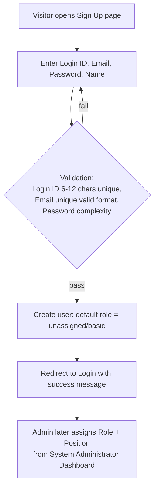

| User Action                                            | System Action                                                                  | Database Action                                                        | Inventory Impact |
| ------------------------------------------------------ | ------------------------------------------------------------------------------ | ---------------------------------------------------------------------- | ---------------- |
| Enters Login ID, Email, Password, Name on Sign Up form | Validates shape (Zod) then business rules (uniqueness, complexity) server-side | `INSERT users` with `role_id = unassigned`, `password_hash` via bcrypt | None             |
| —                                                      | Redirects to Login with a success toast                                        | —                                                                      | —                |

**Note:** the new account has **zero module access** until an Admin assigns a real Role and Position. This is not a gap in the demo flow — it is PRD FR-1.3, and it is exactly the control a judge would expect from a real ERP: nobody self-grants access.

### 1.2 Login

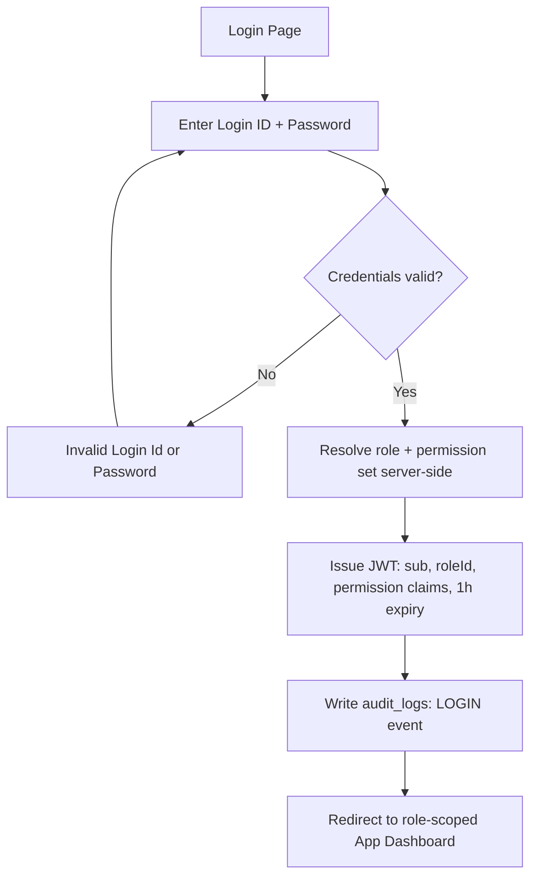

| User Action                 | System Action                                                                                                 | Database Action                                                | Inventory Impact |
| --------------------------- | ------------------------------------------------------------------------------------------------------------- | -------------------------------------------------------------- | ---------------- |
| Submits Login ID + Password | `bcrypt.compare()` against stored hash; on success, resolves role server-side (never client-selected, FR-1.2) | `SELECT users WHERE login_id = ?`; `INSERT audit_logs` (LOGIN) | None             |
| —                           | Issues JWT with embedded permission claims; frontend stores token in memory only (never `localStorage`)       | —                                                              | —                |
| — (on failure)              | Returns the exact string `"Invalid Login Id or Password"` — never reveals which field was wrong               | —                                                              | —                |

### 1.3 Self-Profile Edit

| User Action                                         | System Action                                                                                                                        | Database Action                                        | Inventory Impact |
| --------------------------------------------------- | ------------------------------------------------------------------------------------------------------------------------------------ | ------------------------------------------------------ | ---------------- |
| Edits Name / Address / Mobile Number on own profile | Accepts only the self-editable whitelist; silently `403`s any attempt to change `email` or `position` even if present in the payload | `UPDATE users`; one `audit_logs` row per changed field | None             |
| Attempts to edit Email                              | Rejected — immutable post-signup                                                                                                     | —                                                      | None             |
| Attempts to edit Position                           | Rejected unless actor is Admin                                                                                                       | —                                                      | None             |

### 1.4 Admin Role Assignment

| User Action                                                                                 | System Action                                                        | Database Action                                                  | Inventory Impact |
| ------------------------------------------------------------------------------------------- | -------------------------------------------------------------------- | ---------------------------------------------------------------- | ---------------- |
| Admin opens System Administrator Dashboard, selects a pending user, assigns Role + Position | `PATCH /users/:id` — Admin-only route                                | `UPDATE users SET role_id, position`; `audit_logs` row per field | None             |
| —                                                                                           | User's next login issues a JWT with the new role's permission claims | —                                                                | —                |

---

## 2. Dashboard Flow

### 2.1 Landing / App Entry

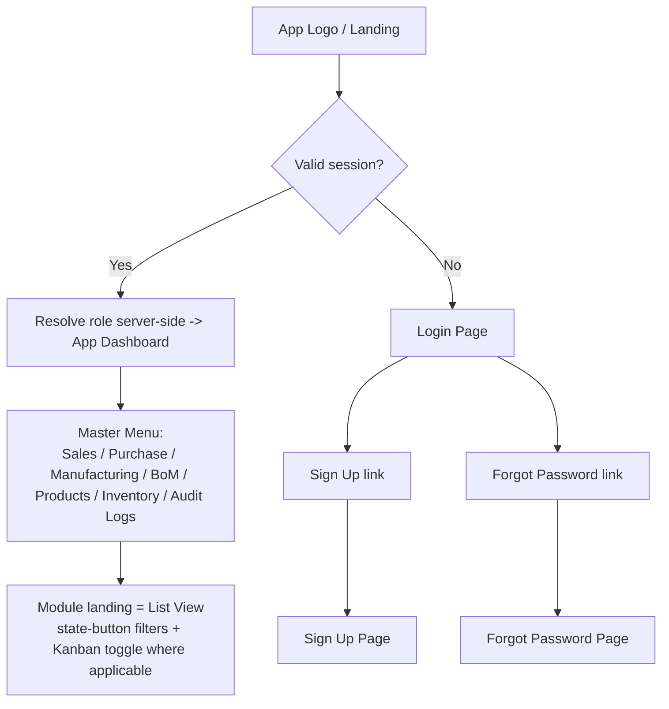

### 2.2 Role-Scoped Dashboard Load

| User Action                    | System Action                                                                                                                                      | Database Action                                                                                            | Inventory Impact |
| ------------------------------ | -------------------------------------------------------------------------------------------------------------------------------------------------- | ---------------------------------------------------------------------------------------------------------- | ---------------- |
| Lands on Dashboard after login | `GET /dashboard/counters` (six PRD-mandated KPIs) + `GET /dashboard/role-summary` (role-specific widgets)                                          | Reads `dashboard_order_counters` view + role-specific aggregate queries — all indexed, designed for <500ms | Read-only        |
| Dashboard auto-refreshes       | React Query `refetchInterval` polls every 5–10s — **polling, not WebSockets**, an explicit PRD trade for demo reliability over infrastructure risk | Same read queries re-run                                                                                   | Read-only        |

### 2.3 Role-Specific Widget Sets (PRD §14)

| Role               | Headline Widgets                                                                                                                |
| ------------------ | ------------------------------------------------------------------------------------------------------------------------------- |
| Admin              | Audit summary tiles (Total/Create/Update/Delete), active users by role, all-module order counters, reconciliation health banner |
| Business Owner     | Six cross-module KPI counters, delayed orders by module, manufacturing efficiency, material shortage watch                      |
| Sales User         | Total SOs, pending deliveries, orders by status, delayed deliveries, revenue this month                                         |
| Purchase User      | Total POs, partial receipts, auto-created POs awaiting action, delayed receipts, spend by vendor                                |
| Manufacturing User | Open MOs, auto-created MOs awaiting confirm, delayed MOs, Manufacturing Kanban, work-center utilization                         |
| Inventory Manager  | Low-stock alerts, live stock-movement feed, On Hand / Reserved / Free-to-Use snapshot table                                     |

Every widget is **filtered server-side by role**, never hidden purely in the UI (PRD NFR "Security") — the `GET /dashboard/role-summary` payload shape itself varies by `req.user.role`, so there is no client-side branch that could leak a wider data set than the role permits.

---

## 3. Product Flow

### 3.1 Create Product

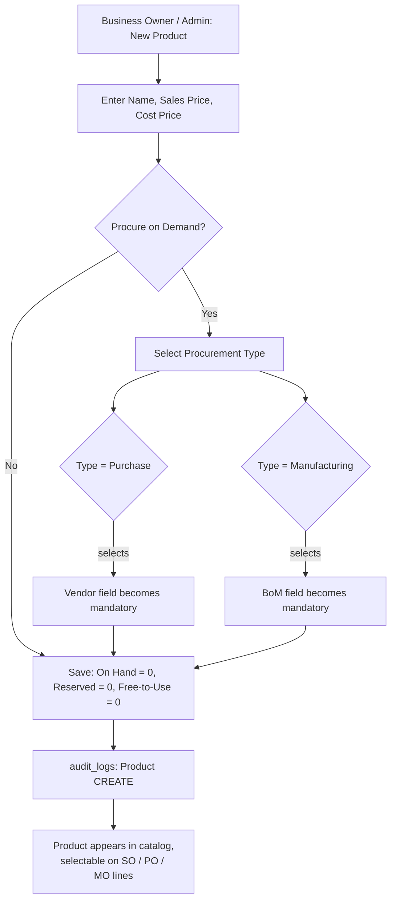

| User Action                          | System Action                                                                                                                                                                                                                                | Database Action                                                                                                                                                              | Inventory Impact                           |
| ------------------------------------ | -------------------------------------------------------------------------------------------------------------------------------------------------------------------------------------------------------------------------------------------- | ---------------------------------------------------------------------------------------------------------------------------------------------------------------------------- | ------------------------------------------ |
| Enters Name, Sales Price, Cost Price | Shape validation (Zod)                                                                                                                                                                                                                       | —                                                                                                                                                                            | None                                       |
| Toggles `Procure on Demand` on       | Makes `Procurement Type` mandatory; selecting Purchase makes Vendor mandatory, selecting Manufacturing makes BoM mandatory — **conditional-mandatory rule blocked at this save step**, never deferred to SO confirm time (PRD §9 Edge Cases) | `INSERT products` with conditional `CHECK` constraints (`chk_procurement_vendor`, `chk_procure_on_demand_type`) as a structural backstop behind the service-layer validation | None — a new product starts at On Hand = 0 |
| Saves                                | Server generates `reference` (`PROD-0001`, sequential) — never client-suppliable                                                                                                                                                             | `INSERT products`; `INSERT audit_logs` (CREATE)                                                                                                                              | None                                       |

### 3.2 Product Detail / Stock Card

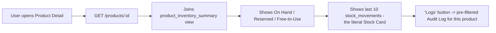

| User Action                   | System Action                                                             | Database Action                                                                          | Inventory Impact |
| ----------------------------- | ------------------------------------------------------------------------- | ---------------------------------------------------------------------------------------- | ---------------- |
| Opens a product's detail page | `GET /products/:id`                                                       | Reads `product_inventory_summary` view + last 10 `stock_movements` rows for this product | Read-only        |
| Clicks "Logs"                 | Opens Audit Log pre-filtered to `record_type='Product' AND record_id=:id` | `GET /products/:id/audit-logs`                                                           | None             |

This Stock Card view is the literal, on-screen proof — for any judge who asks — that On Hand is **computed from movements**, not typed into a box:

```
2026-06-01  PURCHASE_RECEIPT   +100   PO-000012
2026-06-07  SALES_DELIVERY      -10   SO-000031
2026-06-10  MO_CONSUMPTION      -40   MO-2026-004
```

### 3.3 Manual Stock Adjustment (Inventory Manager / Admin only)

| User Action                                                                        | System Action                                                                             | Database Action                                                                                                                          | Inventory Impact                                                                                                                                               |
| ---------------------------------------------------------------------------------- | ----------------------------------------------------------------------------------------- | ---------------------------------------------------------------------------------------------------------------------------------------- | -------------------------------------------------------------------------------------------------------------------------------------------------------------- |
| Opens product, selects "Adjust Stock", enters direction (IN/OUT), quantity, reason | `POST /products/:id/stock-adjustments`; rejects OUT adjustments exceeding current On Hand | `INSERT stock_movements` (`source_type='MANUAL_ADJUSTMENT'`); `UPDATE products.on_hand_qty` in the same transaction; `INSERT audit_logs` | On Hand increases (IN) or decreases (OUT) — the **only** path by which any role can directly affect On Hand outside the standard order lifecycles (PRD FR-2.4) |

---

## 4. Sales Flow

### 4.1 Create Sales Order (Draft)

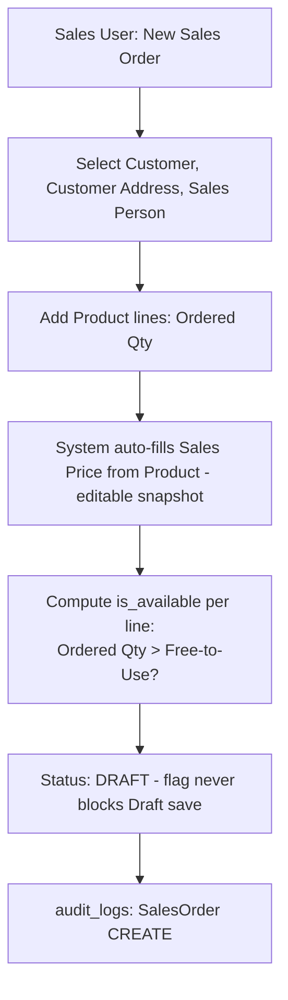

| User Action                             | System Action                                                                                                                       | Database Action                                             | Inventory Impact |
| --------------------------------------- | ----------------------------------------------------------------------------------------------------------------------------------- | ----------------------------------------------------------- | ---------------- |
| Selects Customer, Address, Sales Person | Server auto-sets `order_date = now()`                                                                                               | —                                                           | None             |
| Adds Product lines with Ordered Qty     | Sales Price auto-populated from `products.sales_price` at this moment — an editable **snapshot**, not a live reference (PRD FR-2.3) | `INSERT sales_orders` (`DRAFT`); `INSERT sales_order_items` | None             |
| —                                       | Computes `is_available` per line (`ordered_qty > free_to_use_qty`) — informational only, never blocks Draft save (PRD FR-3.3)       | Reads `product_inventory_summary` view                      | Read-only check  |

### 4.2 Confirm Sales Order — Reserve Stock, Trigger Procurement

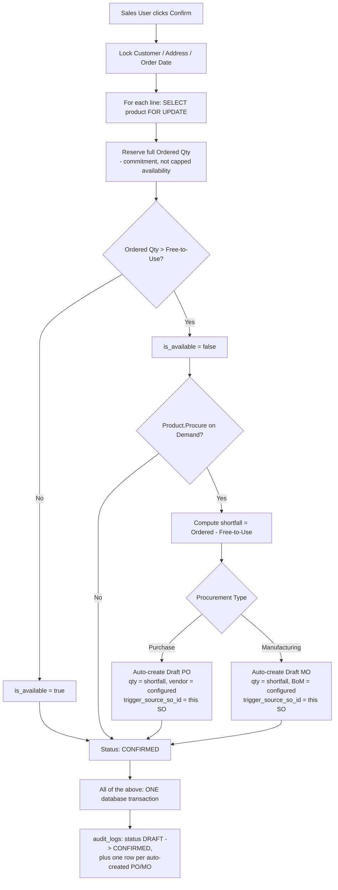

| User Action    | System Action                                                                                                                                                                                    | Database Action                                                                                                | Inventory Impact                                                                                                     |
| -------------- | ------------------------------------------------------------------------------------------------------------------------------------------------------------------------------------------------ | -------------------------------------------------------------------------------------------------------------- | -------------------------------------------------------------------------------------------------------------------- |
| Clicks Confirm | Locks Customer/Address/Order Date fields (PRD FR-3.4); row-locks every line's product `FOR UPDATE` before reading current Free-to-Use (prevents concurrent over-reservation — PRD §9 Edge Cases) | `UPDATE sales_orders.status = 'CONFIRMED'`                                                                     | None directly — **reservation is not a stock movement**                                                              |
| —              | Reserves the **full** `ordered_qty` per line — reservation represents commitment, not capped availability; it does not shrink to fit what's on hand                                              | `INSERT inventory_reservations` (`source_type='SALES_ORDER'`, `is_active=true`) per line                       | Reserved Qty increases; On Hand unchanged; Free-to-Use decreases                                                     |
| —              | Evaluates Procurement Engine per line: if `procure_on_demand=true` and shortfall > 0, auto-creates a Draft PO or MO for **exactly the shortfall**                                                | `INSERT purchase_orders`/`INSERT manufacturing_orders` (`auto_created=true`, `trigger_source_so_id=<this SO>`) | None yet — the auto-created PO/MO is itself still `Draft` and has no stock effect until it's confirmed and fulfilled |
| —              | Writes one audit row for the status change, plus one for each auto-created PO/MO                                                                                                                 | `INSERT audit_logs` (multiple rows, one transaction)                                                           | —                                                                                                                    |
| —              | All of the above executes inside **one Prisma transaction** — a failure at any step rolls back the entire confirm action                                                                         | `COMMIT` (or full rollback)                                                                                    | Atomic                                                                                                               |

**Worked example (matches FINAL_TRD.md §6.4 Example B):** Dining Table On Hand = 5, Reserved = 0. Customer orders 20. Confirm → reserve the full 20 (Free-to-Use check: 20 > 5 → `is_available = false`) → Procurement Engine computes shortfall = 15 → auto-creates Draft MO for 15 units, linked via `trigger_source_so_id`. The Sales User sees the SO move to `CONFIRMED` with an Availability flag, and a notification that Manufacturing now has a new Draft MO waiting for their action.

### 4.3 Deliver Sales Order

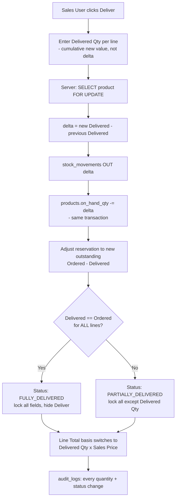

| User Action                                                     | System Action                                                                                                                                                                 | Database Action                                                                            | Inventory Impact                                                                   |
| --------------------------------------------------------------- | ----------------------------------------------------------------------------------------------------------------------------------------------------------------------------- | ------------------------------------------------------------------------------------------ | ---------------------------------------------------------------------------------- |
| Enters new Delivered Qty (cumulative, e.g. "now delivered: 10") | Server computes `delta = new − previous` itself, inside the row lock — never trusts a client-computed delta (closes a concurrent-submission race, FINAL_TRD.md §6.5)          | `INSERT stock_movements` (`OUT`, `source_type='SALES_DELIVERY'`, qty = delta)              | **On Hand decreases** by the delta — this is a real stock movement, unlike Confirm |
| —                                                               | Adjusts the line's reservation down to the new outstanding (`ordered_qty − delivered_qty`); if fully delivered, releases the reservation entirely                             | `UPDATE inventory_reservations` (close old, open new with reduced qty, or release if zero) | Reserved Qty decreases correspondingly                                             |
| —                                                               | Recomputes line Total: basis switches from `ordered_qty × sales_price` to `delivered_qty × sales_price` the moment any delivery occurs (PRD Business Rule 5)                  | `UPDATE sales_order_items.total_amount`                                                    | —                                                                                  |
| —                                                               | Recomputes header status: all lines fully delivered → `FULLY_DELIVERED` (lock everything, hide Deliver action); otherwise → `PARTIALLY_DELIVERED` (Deliver remains available) | `UPDATE sales_orders.status`                                                               | —                                                                                  |
| —                                                               | API rejects any call where cumulative delivered would exceed ordered (PRD FR-3.7)                                                                                             | `422` response, no write                                                                   | None                                                                               |

**Why this never double-counts:** a second partial delivery call (e.g. going from `delivered_qty=6` to `delivered_qty=10`) computes `delta = 4`, not `10` — repeated partial calls are safe to retry or resubmit because the server always derives the delta from current DB state, never from what the client thinks the delta should be.

### 4.4 Cancel Sales Order

| User Action                               | System Action                                                                                                                                | Database Action                                                                                                               | Inventory Impact                         |
| ----------------------------------------- | -------------------------------------------------------------------------------------------------------------------------------------------- | ----------------------------------------------------------------------------------------------------------------------------- | ---------------------------------------- |
| Clicks Cancel (only available in `DRAFT`) | Releases any reservation (defensive — a Draft SO shouldn't normally hold one, but the release call is harmless if it does); locks the record | `UPDATE sales_orders.status = 'CANCELLED'`; `UPDATE inventory_reservations SET is_active=false` (if any); `INSERT audit_logs` | None — nothing was ever physically moved |

---

## 5. Purchase Flow

### 5.1 Create Purchase Order (Manual or Auto-Created)

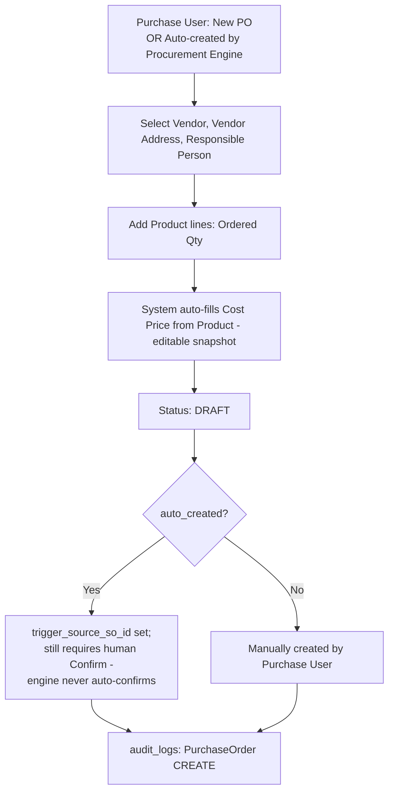

| User Action                                                                             | System Action                                                                                                                                                                                                   | Database Action                                                   | Inventory Impact |
| --------------------------------------------------------------------------------------- | --------------------------------------------------------------------------------------------------------------------------------------------------------------------------------------------------------------- | ----------------------------------------------------------------- | ---------------- |
| Selects Vendor, Vendor Address, Responsible Person; adds Product lines with Ordered Qty | Cost Price auto-populated from `products.cost_price` at this moment — editable snapshot (PRD FR-2.3)                                                                                                            | `INSERT purchase_orders` (`DRAFT`); `INSERT purchase_order_items` | None             |
| _(If auto-created by the Procurement Engine instead)_                                   | Carries `auto_created=true` and `trigger_source_so_id` pointing back to the triggering SO; **still requires a human Confirm** before it proceeds — the engine never auto-confirms (PRD FR-4.6, Business Rule 3) | Same inserts, with those two fields set                           | None             |

### 5.2 Confirm Purchase Order

| User Action    | System Action                            | Database Action                               | Inventory Impact                                                                                                                                                                                                                 |
| -------------- | ---------------------------------------- | --------------------------------------------- | -------------------------------------------------------------------------------------------------------------------------------------------------------------------------------------------------------------------------------- |
| Clicks Confirm | Locks Vendor, Vendor Address, Order Date | `UPDATE purchase_orders.status = 'CONFIRMED'` | **None.** Confirming a PO never moves stock — only receiving does (PRD FR-4.3). This is a deliberate, literal distinction the demo should narrate explicitly, since it's the inverse of what a first-time observer might assume. |

### 5.3 Receive Goods (Partial or Full)

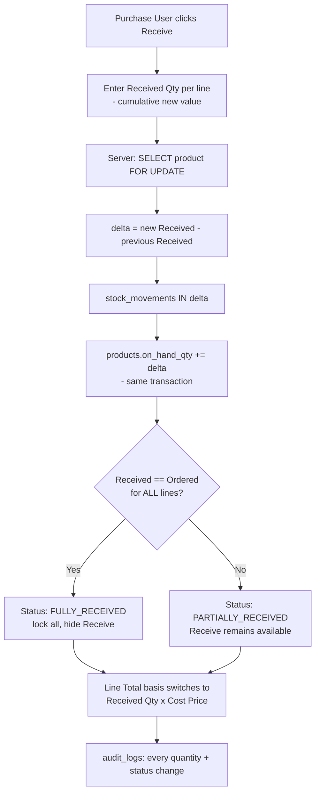

| User Action                          | System Action                                                                                                    | Database Action                                                                | Inventory Impact                                     |
| ------------------------------------ | ---------------------------------------------------------------------------------------------------------------- | ------------------------------------------------------------------------------ | ---------------------------------------------------- |
| Enters new Received Qty (cumulative) | Server computes the delta itself inside the row lock, identical pattern to Sales Delivery (Section 4.3)          | `INSERT stock_movements` (`IN`, `source_type='PURCHASE_RECEIPT'`, qty = delta) | **On Hand increases** by the delta                   |
| —                                    | Recomputes line Total: basis switches from `ordered_qty × cost_price` to `received_qty × cost_price`             | `UPDATE purchase_order_items.total_amount`                                     | —                                                    |
| —                                    | Recomputes header status: all lines fully received → `FULLY_RECEIVED`; else → `PARTIALLY_RECEIVED`               | `UPDATE purchase_orders.status`                                                | —                                                    |
| —                                    | If this PO was `auto_created` and tied to an MTO chain, Manufacturing can now proceed (components are available) | —                                                                              | Indirectly unblocks any MO waiting on this component |

**A PO partially received with the remainder never received** stays `Partially Received` indefinitely and surfaces under Delayed Orders once past its `expected_receipt_date` (PRD §9 Edge Cases) — there is no silent auto-completion of a stalled PO.

### 5.4 Cancel Purchase Order

| User Action                       | System Action    | Database Action                                                    | Inventory Impact |
| --------------------------------- | ---------------- | ------------------------------------------------------------------ | ---------------- |
| Clicks Cancel (only from `DRAFT`) | Locks the record | `UPDATE purchase_orders.status = 'CANCELLED'`; `INSERT audit_logs` | None             |

---

## 6. Manufacturing Flow

### 6.1 Create Manufacturing Order

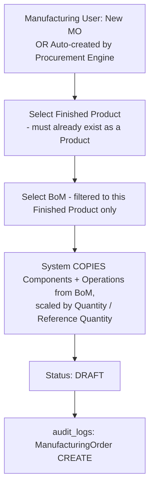

| User Action                                                                                                                             | System Action                                                                                                                                                                                     | Database Action                                                                                        | Inventory Impact |
| --------------------------------------------------------------------------------------------------------------------------------------- | ------------------------------------------------------------------------------------------------------------------------------------------------------------------------------------------------- | ------------------------------------------------------------------------------------------------------ | ---------------- |
| Selects Finished Product (must already exist — an MO never implicitly creates one, PRD FR-5.1) and a BoM whose finished product matches | Validates `bom.finished_product_id == finishedProductId`; `422` otherwise                                                                                                                         | —                                                                                                      | None             |
| Enters Quantity                                                                                                                         | **Copies** (not live-joins) `bom_items`→`manufacturing_order_components` and `bom_operations`→`work_orders`, scaled: `required_qty = bom_items.quantity × (mo.quantity / bom.reference_quantity)` | `INSERT manufacturing_orders` (`DRAFT`); `INSERT manufacturing_order_components`; `INSERT work_orders` | None             |

**Why a copy, not a live reference:** if the BoM is edited after this MO is created, the edit must never retroactively change this in-flight MO's recipe — only new MOs see the updated BoM (PRD FR-5.1). This is what makes "the recipe changed under me mid-production" structurally impossible rather than merely unlikely.

### 6.2 Confirm Manufacturing Order

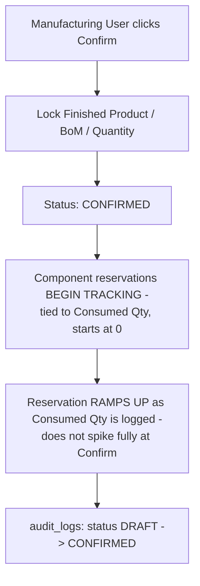

| User Action    | System Action                                                                                                                                                                                                                                                                   | Database Action                                                                                                                | Inventory Impact                                                        |
| -------------- | ------------------------------------------------------------------------------------------------------------------------------------------------------------------------------------------------------------------------------------------------------------------------------- | ------------------------------------------------------------------------------------------------------------------------------ | ----------------------------------------------------------------------- |
| Clicks Confirm | Locks Finished Product, BoM, Quantity — immutable from this point; a quantity change now requires Cancel + new MO (PRD FR-5.8)                                                                                                                                                  | `UPDATE manufacturing_orders.status = 'CONFIRMED'`                                                                             | None directly                                                           |
| —              | Begins component reservation tracking — but tied to `consumed_qty` (which starts at 0), not `required_qty` — so reservation ramps up as production proceeds rather than spiking fully the instant Confirm is clicked (PRD FR-5.4, see FINAL_TRD.md §7.3 for the full rationale) | `INSERT inventory_reservations` (`source_type='MANUFACTURING_ORDER'`, initial `reserved_qty = consumed_qty = 0` per component) | Reserved Qty contribution starts at 0 and grows with logged consumption |

### 6.3 Start & Execute Work Orders

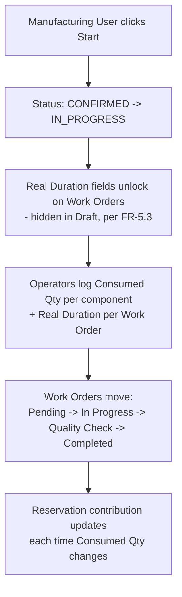

| User Action                                                 | System Action                                                                                        | Database Action                                                                                        | Inventory Impact                                                                                                        |
| ----------------------------------------------------------- | ---------------------------------------------------------------------------------------------------- | ------------------------------------------------------------------------------------------------------ | ----------------------------------------------------------------------------------------------------------------------- |
| Clicks Start                                                | `CONFIRMED → IN_PROGRESS`; unlocks Real Duration entry on Work Orders                                | `UPDATE manufacturing_orders.status = 'IN_PROGRESS'`                                                   | None                                                                                                                    |
| Operator enters Consumed Qty per component as work proceeds | Updates the live consumption figure; visible from `CONFIRMED` onward, locked from `DONE`/`CANCELLED` | `UPDATE manufacturing_order_components.consumed_qty`; reservation contribution updates correspondingly | Reserved Qty rises with logged consumption (no stock movement yet — nothing is written to `stock_movements` until Done) |
| Operator updates a Work Order's status / logs Real Duration | Feeds the Manufacturing Kanban differentiator (`Pending → In Progress → Quality Check → Completed`)  | `UPDATE work_orders.status, real_duration_minutes, started_at/completed_at`                            | None                                                                                                                    |

### 6.4 Complete Manufacturing Order — The Critical Atomic Step

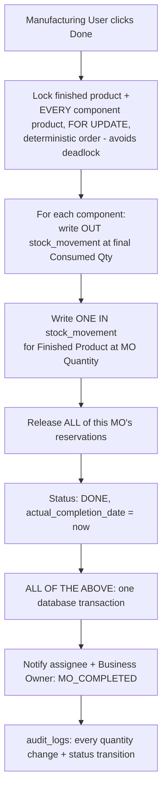

| User Action | System Action                                                                                                                                                                                                                                | Database Action                                                                                                                | Inventory Impact                                     |
| ----------- | -------------------------------------------------------------------------------------------------------------------------------------------------------------------------------------------------------------------------------------------- | ------------------------------------------------------------------------------------------------------------------------------ | ---------------------------------------------------- |
| Clicks Done | Locks the finished-product row **and every component product row** `FOR UPDATE`, all in a deterministic order (sorted by product UUID) to avoid a deadlock against a concurrent MO touching an overlapping component set (FINAL_TRD.md §6.5) | `SELECT ... FOR UPDATE` × N                                                                                                    | —                                                    |
| —           | For each component: writes an OUT movement at its **final** `consumed_qty` (what was actually used, which may differ from the originally planned `required_qty`)                                                                             | `INSERT stock_movements` (`OUT`, `source_type='MO_CONSUMPTION'`) per component; `UPDATE products.on_hand_qty -=` per component | On Hand **decreases** for every component            |
| —           | Writes one IN movement for the finished product at `mo.quantity`                                                                                                                                                                             | `INSERT stock_movements` (`IN`, `source_type='MO_PRODUCTION'`)                                                                 | On Hand **increases** for the finished product       |
| —           | Releases every active reservation tied to this MO                                                                                                                                                                                            | `UPDATE inventory_reservations SET is_active=false`                                                                            | Reserved Qty contribution from this MO drops to zero |
| —           | Sets status `DONE`                                                                                                                                                                                                                           | `UPDATE manufacturing_orders.status, actual_completion_date`                                                                   | —                                                    |
| —           | **All of the above in one transaction** — a constraint violation on any single component rolls back the entire completion; never "half-consumed, no output"                                                                                  | `COMMIT` (or full rollback)                                                                                                    | Atomic                                               |
| —           | Fires `MO_COMPLETED` notification to the assignee and the Business Owner role                                                                                                                                                                | `INSERT notifications`                                                                                                         | —                                                    |

**Worked example — the PRD's literal acceptance criterion (10 Tables, BoM: 4 Legs / 1 Top / 12 Screws):** Done writes OUT 40 Legs / OUT 10 Tops / OUT 120 Screws and IN 10 Tables, in one transaction. This is the exact sentence in FINAL_PRD.md §13 — it is reproduced here because it is also the single most demo-worthy moment in the entire application: clicking one button and watching four ledger rows land atomically is the literal proof of the "ledger as single source of truth" claim.

### 6.5 Cancel Manufacturing Order

| User Action                                                 | System Action                                | Database Action                                                                                                              | Inventory Impact                                                                                                                                                                                                                                                                                                          |
| ----------------------------------------------------------- | -------------------------------------------- | ---------------------------------------------------------------------------------------------------------------------------- | ------------------------------------------------------------------------------------------------------------------------------------------------------------------------------------------------------------------------------------------------------------------------------------------------------------------------- |
| Clicks Cancel (only from `DRAFT`/`CONFIRMED`/`IN_PROGRESS`) | Releases all active reservations for this MO | `UPDATE manufacturing_orders.status = 'CANCELLED'`; `UPDATE inventory_reservations SET is_active=false`; `INSERT audit_logs` | **None.** No stock movement is ever emitted on cancel — nothing was physically consumed or produced (PRD FR-5.7). This is the precise mirror of Section 4.4's Sales cancel logic, and the demo script should narrate both the same way: "cancel before anything physical happened" leaves the ledger untouched by design. |

---

## 7. Bill of Materials Flow

### 7.1 Create BoM

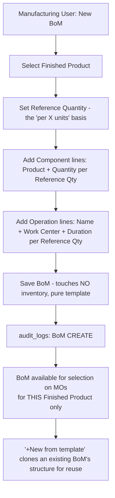

| User Action                                                                                                                                    | System Action                                                                                                   | Database Action                                                     | Inventory Impact                                                                                |
| ---------------------------------------------------------------------------------------------------------------------------------------------- | --------------------------------------------------------------------------------------------------------------- | ------------------------------------------------------------------- | ----------------------------------------------------------------------------------------------- |
| Selects Finished Product, sets Reference Quantity, adds Component lines (product + quantity) and Operation lines (name, work center, duration) | Validates no component equals the finished product itself (no self-referencing BoM); `referenceQuantity > 0`    | `INSERT bom`; `INSERT bom_items`; `INSERT bom_operations`           | **None.** Creating a BoM is a pure template operation — it never touches inventory (PRD FR-6.2) |
| —                                                                                                                                              | Server generates `reference` (`BOM-0001`, sequential)                                                           | —                                                                   | —                                                                                               |
| Clicks "+New from template" on an existing BoM                                                                                                 | Clones its component/operation structure into a new editable draft BoM, for reuse on a similar finished product | `INSERT bom`/`bom_items`/`bom_operations` (new rows, copied values) | None                                                                                            |

### 7.2 Edit / Delete BoM

| User Action                                                              | System Action                                                                                                                          | Database Action                           | Inventory Impact |
| ------------------------------------------------------------------------ | -------------------------------------------------------------------------------------------------------------------------------------- | ----------------------------------------- | ---------------- |
| Edits an active BoM that already has Done/In-Progress MOs referencing it | **Allowed** — MOs snapshot their recipe at creation (Section 6.1), so editing the template never retroactively touches an in-flight MO | `UPDATE bom`/`bom_items`/`bom_operations` | None             |
| Attempts to delete a BoM that is some product's `default_bom_id`         | **Blocked** — `409 Conflict` (PRD FR-6.4, §9 Edge Cases)                                                                               | No delete executed                        | None             |

---

## 8. Procurement Flow

### 8.1 Automatic Trigger (the engine itself)

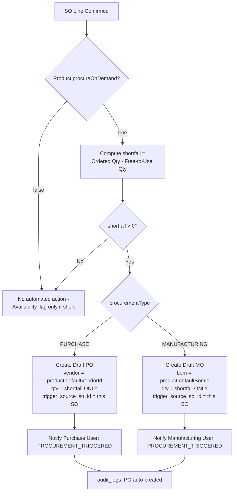

| User Action                                                                  | System Action                                                                                                                                                                                                                               | Database Action                                                                                                                                                        | Inventory Impact                               |
| ---------------------------------------------------------------------------- | ------------------------------------------------------------------------------------------------------------------------------------------------------------------------------------------------------------------------------------------- | ---------------------------------------------------------------------------------------------------------------------------------------------------------------------- | ---------------------------------------------- |
| _(No direct user action — this runs inside SO Confirm, Section 4.2, step 3)_ | `procurementEngine.evaluate(tx, productId, requiredQty, actor)` reads the product's procurement config, computes shortfall using the **exact same** Free-to-Use formula used everywhere else in the system (one function, never duplicated) | `INSERT purchase_orders`/`manufacturing_orders` (`Draft`, `auto_created=true`) via the same repositories a manual creation would use — identical validation either way | None yet — the new PO/MO is itself still Draft |
| —                                                                            | Fires a `PROCUREMENT_TRIGGERED` notification to the relevant role                                                                                                                                                                           | `INSERT notifications`                                                                                                                                                 | —                                              |

**The single rule that prevents over-ordering:** quantity is **always the shortfall**, never the full order quantity (PRD FR-7.2/7.3). If a customer orders 20 and 5 are free-to-use, the auto-created PO/MO is for 15 — not 20. This is checked in FINAL_TRD.md §7.1's worked examples and should be explicitly narrated in the demo, since it is the detail most likely to be glossed over by a less careful implementation.

### 8.2 Strategic Procurement Recommendation View

```
┌─────────────────────────────────────────────────────┐
│  Wooden Table — Shortage: 15 units                   │
│  Triggered by: SO-000031 (Ramesh Traders)             │
│                                                        │
│   MANUFACTURE             │   PURCHASE                │
│   Cost: ₹40,000           │   Cost: ₹50,000           │
│   Lead Time: 3 Days       │   Lead Time: 2 Days       │
│   Score: 2.1              │   Score: 3.4              │
│   Components: Ready       │   Vendor: Sharma Supplies │
│                                                        │
│   Recommendation: Manufacture (lower score)            │
│   Auto-created: Draft MO-2026-007                       │
│   [View Draft MO]   [Override: Create PO Instead]      │
└─────────────────────────────────────────────────────┘
```

| User Action                                                                               | System Action                                                                                                                                                | Database Action                                                                                                                                              | Inventory Impact                                         |
| ----------------------------------------------------------------------------------------- | ------------------------------------------------------------------------------------------------------------------------------------------------------------ | ------------------------------------------------------------------------------------------------------------------------------------------------------------ | -------------------------------------------------------- |
| Purchase/Manufacturing User opens the alert (from a notification or the Procurement view) | Displays both raw inputs (cost, lead time, shortage ratio) and the resulting score for both routes — fully explainable, never a black-box number (PRD §11.1) | Reads existing `vendors.lead_time_days`, `products.cost_price`, `bom_items`/`product_inventory_summary` — **nothing invented, nothing estimated by a model** | Read-only                                                |
| Clicks "View Draft MO/PO"                                                                 | Navigates to the already-auto-created Draft record for the human Confirm step                                                                                | —                                                                                                                                                            | None until that record is itself confirmed and fulfilled |

**Why no AI anywhere in this view:** PRD §11.1 and FINAL_TRD.md §7.2 are explicit — every input is read from data that already exists, every weight (0.5/0.3/0.2) is fixed and disclosed, and the resulting score is reproducible by hand with a calculator. This is the literal answer to "how did the system decide that," and it is the answer a judge can verify in real time during the demo.

---

## 9. Inventory Flow (Cross-Cutting)

This flow is not triggered by a single screen — it is the connective tissue every other flow above writes into. It is documented separately because PRD §3 treats it as the one binding architectural premise the entire system rests on.

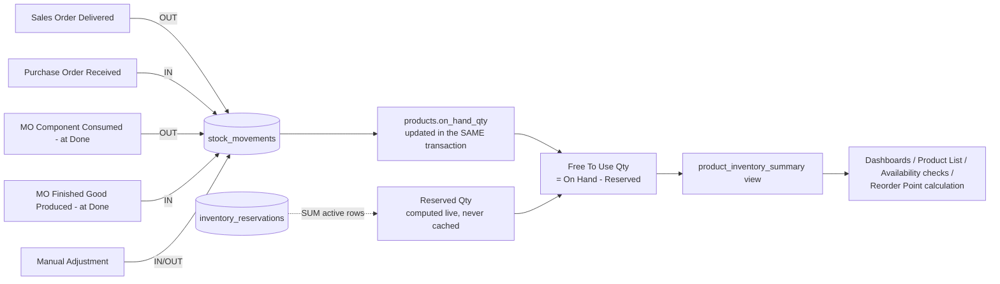

| Trigger Event                                            | Database Action                             | Inventory Impact                       |
| -------------------------------------------------------- | ------------------------------------------- | -------------------------------------- |
| SO line delivered (Section 4.3)                          | `stock_movements` OUT (delta)               | On Hand decreases                      |
| PO line received (Section 5.3)                           | `stock_movements` IN (delta)                | On Hand increases                      |
| MO component consumed, written at Done (Section 6.4)     | `stock_movements` OUT (final consumed qty)  | On Hand decreases per component        |
| MO finished good produced, written at Done (Section 6.4) | `stock_movements` IN (mo.quantity)          | On Hand increases for finished product |
| Manual adjustment (Section 3.3)                          | `stock_movements` IN or OUT (entered value) | On Hand moves in the entered direction |

**The reconciliation invariant** (FINAL_TRD.md §6.1) holds across every one of these events without exception: at any instant, `products.on_hand_qty` equals `SUM(signed stock_movements)` for that product. This is run as a query before the demo — zero mismatched rows is the literal, checkable proof that the architecture's central claim is true, not aspirational.

### 9.1 Inventory / Stock Ledger Browser

| User Action                                                                                  | System Action                                                       | Database Action                                                                             | Inventory Impact |
| -------------------------------------------------------------------------------------------- | ------------------------------------------------------------------- | ------------------------------------------------------------------------------------------- | ---------------- |
| Inventory Manager opens the Stock Ledger view, filters by Product / Source Type / Date Range | `GET /inventory/movements?productId=&sourceType=&dateFrom=&dateTo=` | Reads `stock_movements`, indexed on `(product_id, moved_at)` and `(source_type, source_id)` | Read-only        |
| Opens the Inventory Summary view                                                             | `GET /inventory/summary`                                            | Reads `product_inventory_summary` paginated                                                 | Read-only        |
| _(Admin, pre-demo only)_ runs the reconciliation check                                       | `GET /inventory/reconciliation-check`                               | Runs the §6.1 invariant query; returns any mismatched product IDs (expected: none)          | Read-only        |

---

## 10. Audit Log Flow

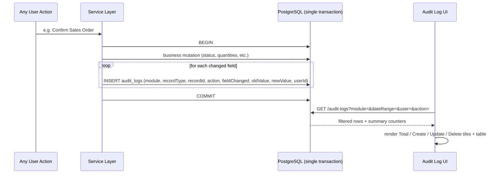

| User Action                                                                                                                                   | System Action                                                                                                                                                                                    | Database Action                                                                                         | Inventory Impact                                |
| --------------------------------------------------------------------------------------------------------------------------------------------- | ------------------------------------------------------------------------------------------------------------------------------------------------------------------------------------------------ | ------------------------------------------------------------------------------------------------------- | ----------------------------------------------- |
| _(No direct trigger — every mutating action across every module above writes here, inline, in the same transaction as the business mutation)_ | One row per **changed field**, not one row per request — matches PRD FR-8.1's exact column list (Date & Time, User, Module, Record Type, Record ID, Action, Field Changed, Old Value, New Value) | `INSERT audit_logs`                                                                                     | None — audit writes never themselves move stock |
| Admin opens `/audit-logs`, filters by Date Range / User / Module / Action                                                                     | `GET /audit-logs?...` returns rows **and** `summary: { totalLogs, createActions, updateActions, deleteActions }` computed in one `COUNT(*) FILTER(...)` query                                    | Reads `audit_logs`, indexed on `(module, occurred_at)`, `(record_type, record_id)`, `user_id`, `action` | Read-only                                       |
| Opens any record's detail view, clicks "Logs"                                                                                                 | Opens the Audit Log pre-filtered to that record                                                                                                                                                  | `GET /:resource/:id/audit-logs`                                                                         | Read-only                                       |
| Any user attempts to edit or delete a log entry                                                                                               | **Rejected — no such UI or API path exists.** Audit logs are append-only by construction (PRD FR-8.4)                                                                                            | —                                                                                                       | —                                               |
| A password is changed anywhere in the system                                                                                                  | The literal password value is never written to `old_value`/`new_value` — only the string `"Password changed."`                                                                                   | `INSERT audit_logs` (field_changed='password', new_value='Password changed.')                           | —                                               |

---

## 11. Traceability Flow

> This flow is built entirely from foreign keys that already exist elsewhere in the schema (`trigger_source_so_id` on both `purchase_orders` and `manufacturing_orders`) — it requires no new table and no new write path. It is purely a multi-table read plus a stepper UI, which is exactly what makes it deliverable inside a 12-hour window despite reading as the most "advanced" feature in the demo.

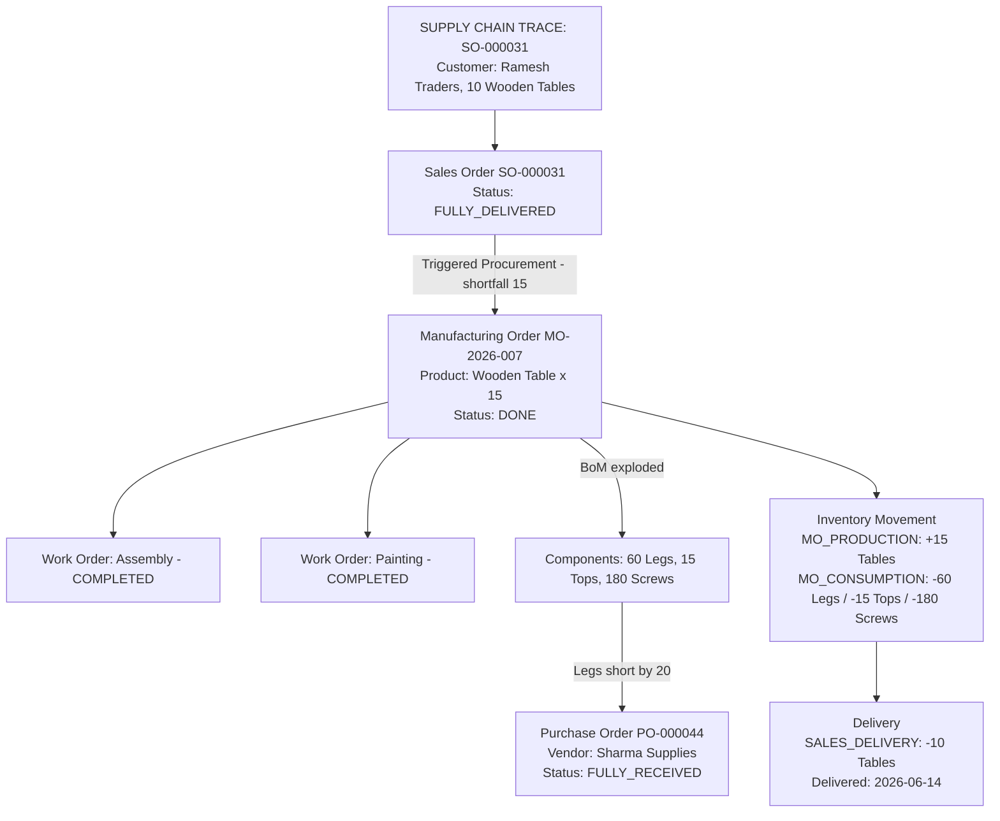

| User Action                                                                    | System Action                                                                                                                                                                                                 | Database Action                                                                                                                                               | Inventory Impact |
| ------------------------------------------------------------------------------ | ------------------------------------------------------------------------------------------------------------------------------------------------------------------------------------------------------------- | ------------------------------------------------------------------------------------------------------------------------------------------------------------- | ---------------- |
| Opens a Sales Order, clicks "Trace" (or opens `/dashboard/traceability/:soId`) | Server assembles the full chain in one query sequence: SO + lines → MOs/POs WHERE `trigger_source_so_id = soId` → Work Orders for each MO → `stock_movements` WHERE `source_id` matches any node in the chain | Multi-table `SELECT` joining `sales_orders`, `manufacturing_orders`, `purchase_orders`, `work_orders`, `stock_movements` via existing FKs — **no new schema** | Read-only        |
| Views the rendered stepper                                                     | Sees, in at most 3 clicks from the original Sales Order: the auto-created MO, its BoM-exploded components, any auto-created PO for a short component, and the receiving vendor                                | —                                                                                                                                                             | —                |

This satisfies PRD NFR "Traceability" literally: _"Any finished-good unit is traceable back through its MO, BoM, and components to any auto-procured Purchase Order and vendor, in at most 3 clicks."_ The demo script should walk this exact path — Sales Order → auto-MO → short-component auto-PO → Vendor — as the closing beat of the live demo, since it is the single view that visually proves every other flow in this document was real and connected, not staged independently per module.

---

## 12. Summary: Inventory Impact per Module

| Module             | Action                    | Direction                                                                              | source_type         |
| ------------------ | ------------------------- | -------------------------------------------------------------------------------------- | ------------------- |
| Sales              | Deliver                   | OUT                                                                                    | `SALES_DELIVERY`    |
| Sales              | Confirm                   | — (reservation only, not a movement)                                                   | —                   |
| Purchase           | Receive                   | IN                                                                                     | `PURCHASE_RECEIPT`  |
| Purchase           | Confirm                   | — (no stock effect)                                                                    | —                   |
| Manufacturing      | Done (component side)     | OUT                                                                                    | `MO_CONSUMPTION`    |
| Manufacturing      | Done (finished-good side) | IN                                                                                     | `MO_PRODUCTION`     |
| Manufacturing      | Confirm / Start / Cancel  | — (reservation only / nothing on Cancel)                                               | —                   |
| Inventory          | Manual Adjustment         | IN or OUT                                                                              | `MANUAL_ADJUSTMENT` |
| Procurement Engine | Auto-create Draft PO/MO   | — (the created record has no stock effect until _it_ is later confirmed and fulfilled) | —                   |

---

_End of FINAL_WEBAPPFLOW.md. See FINAL_TRD.md for the schema and service-layer mechanics underlying every flow above, and FINAL_PRD.md for the binding requirement each flow implements._
